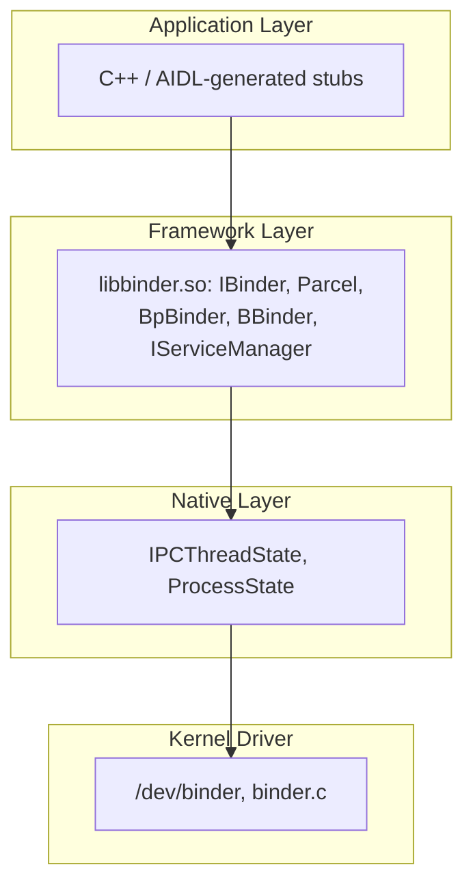
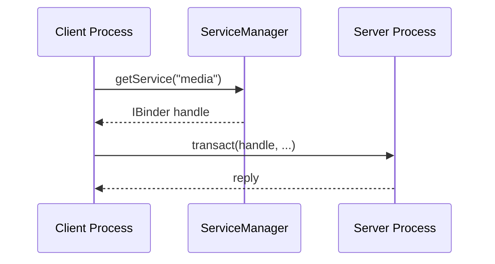
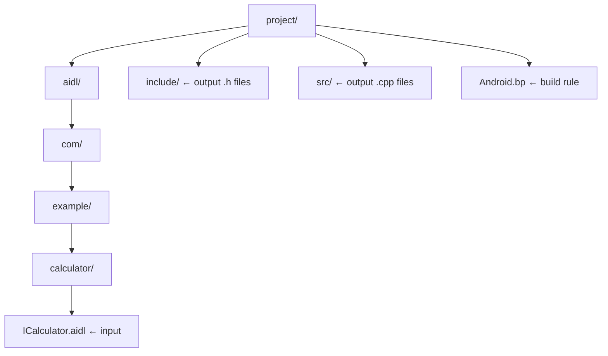
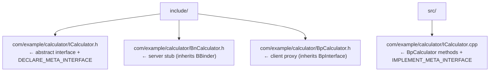
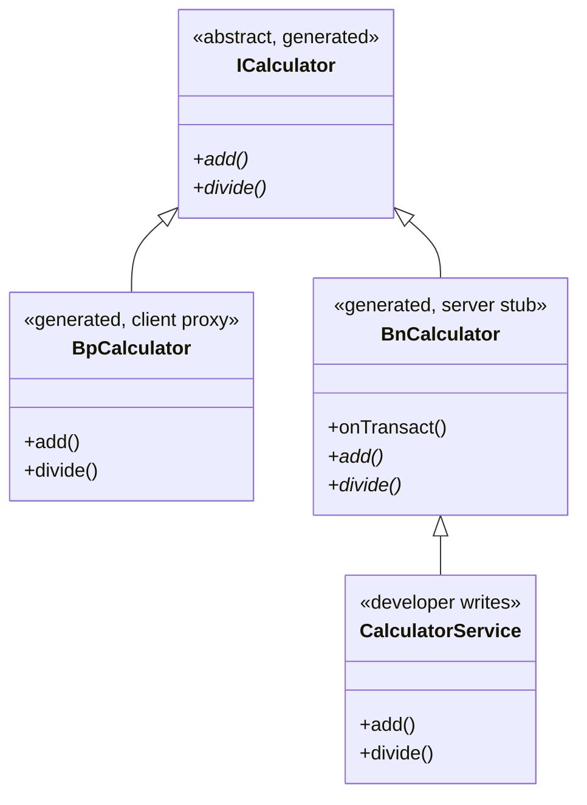
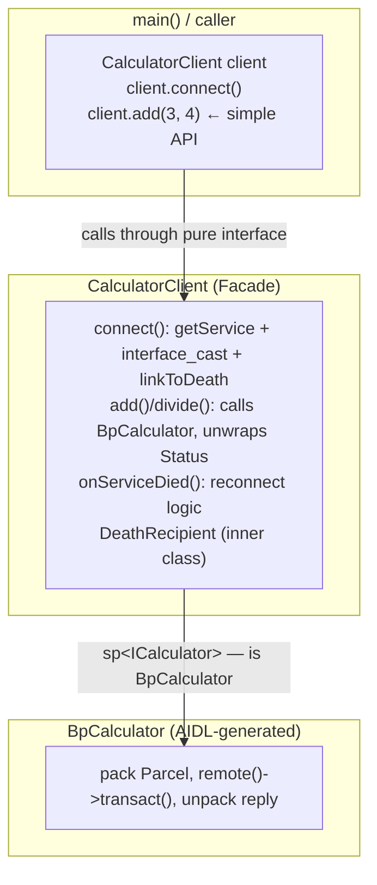
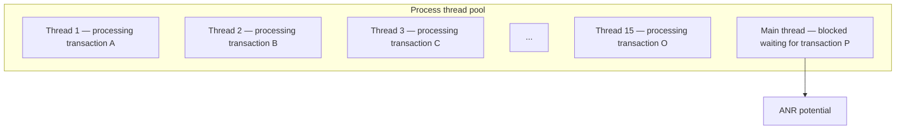
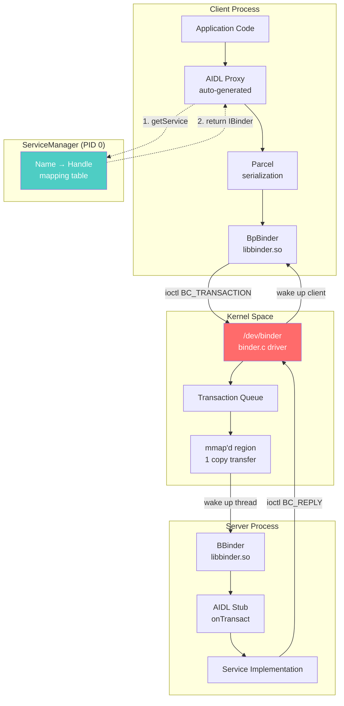
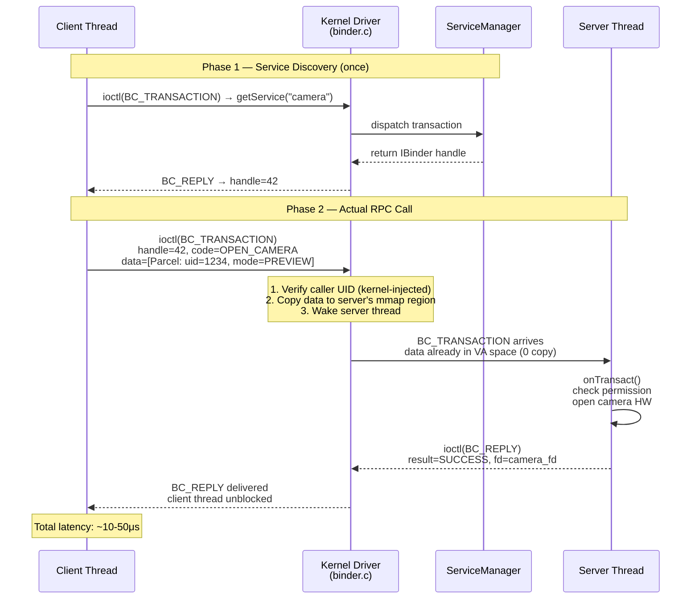
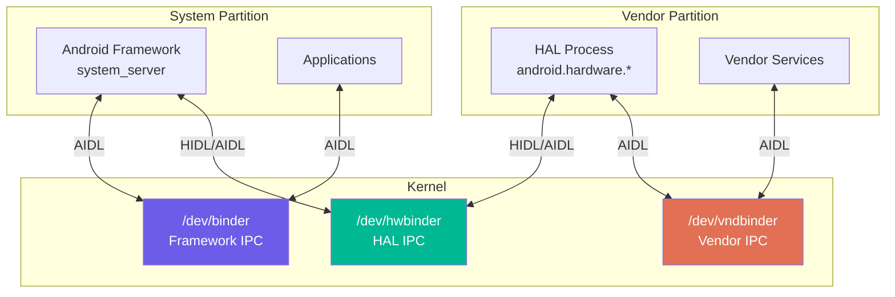

You open an Android app, tap "Share", and the app list appears in under 100ms. Behind that screen are dozens of back-and-forth calls between processes — Activity Manager, Package Manager, and your own app — all coordinating without any hangs or race conditions. How does Android do this? The answer is **Binder IPC**.

If you come from a pure Linux background, the first question will be: why not use sockets, pipes, or shared memory? Linux already has plenty of IPC mechanisms. The answer isn't simply "Binder is faster" — it's that Binder solves a completely different set of problems: **identity, security, and object-oriented RPC** in a multi-process mobile environment.

This article is suited for embedded/system engineers stepping into Android internals, or anyone who wants to understand why an operating system would need to build its own IPC mechanism instead of reusing what's already available. After reading, you'll understand how Binder works from kernel to framework, know when to use Binder over other IPC mechanisms, and be able to read AIDL code without feeling lost.

---

## 1. What Binder Is — And What It Is Not

**Binder** is an Inter-Process Communication (IPC) mechanism integrated into the Linux kernel as a kernel driver (`/dev/binder`), with an accompanying framework layer in Android userspace. It allows one process to call methods on an object residing in another process as if calling a local method — this is **Remote Procedure Call (RPC)** in the fullest sense.

Binder is **not**:
- A network protocol (no sockets, no TCP/IP overhead)
- Plain shared memory (no manual locking needed)
- A message queue (no intermediate buffering)

Binder originated from **OpenBinder**, a project by Be Inc. and Palm, brought into Android and rewritten at the kernel driver level by Dianne Hackborn (Android team). Since Android 1.0, Binder has been the backbone of the entire system.

**Quick comparison with other Linux IPC mechanisms:**

| Mechanism | Data copy | Security | Object ref | Sync RPC |
| --------- | --------- | -------- | ---------- | -------- |
| Pipe | 2 times | No | No | No |
| Unix Socket | 2 times | Limited | No | No |
| Shared Memory | 0 times | No | No | No |
| Binder | 1 time | Yes (UID) | Yes | Yes |

The "1 copy" figure is the core technical point — detailed explanation in a later section.

---

## 2. Why Android Needs Its Own IPC

Before diving into the mechanism, we need to understand what problem Android is solving. Android runs each application in a **separate process** with its own Unix UID — this is the foundational security model. But applications need to communicate with each other and with system services constantly.

**Problem 1 — Security & Identity:**
When app A calls a system service, the service must know for certain "who is this caller, what permissions do they have". Traditional Unix sockets don't guarantee this naturally. Binder solves this by having the kernel automatically fill in the **caller's PID/UID** in each transaction — it cannot be spoofed because the kernel is in control.

**Problem 2 — Object references across processes:**
Android wants to program in an object-oriented model: you receive an `IBinder` reference, call methods on it, and don't need to know which process the object lives in. Pipes and sockets have no concept of this.

**Problem 3 — Synchronous RPC with low latency:**
When an Activity calls `startActivity()`, it needs the result immediately (synchronous). Standard message-passing IPC requires polling or complex callbacks. Binder supports synchronous blocking calls natively.

**Problem 4 — Death notification:**
If a service dies, the client needs to know immediately. Binder has a `linkToDeath()` mechanism — the kernel automatically notifies when a Binder object is destroyed. No other IPC on Linux has this built-in.

---

## 3. Binder Architecture: Four Layers

Binder is not a single thing — it's a stack of four layers working together.



**Kernel Driver Layer (`/dev/binder`):**
This is the true center. The driver manages:
- Memory mapping between processes (mmap)
- Transaction queue
- Thread management
- Reference counting of Binder objects

Since Android 8 (Treble), there are also `/dev/hwbinder` (for HAL) and `/dev/vndbinder` (for vendor processes) — same mechanism but separate domains for security.

**Native Layer (`libbinder.so`):**
Two most important classes:
- `BBinder` — **Binder server side**: the actual object that handles requests
- `BpBinder` — **Binder proxy/client side**: represents the remote object

**Framework Layer (C++ native):**
- `IBinder` — common abstract interface (`frameworks/native/include/binder/IBinder.h`)
- `BBinder` — server-side base class, override `onTransact()`
- `BpBinder` — client-side proxy, wraps handle and calls `IPCThreadState::transact()`
- `Parcel` — container for serializing/deserializing data (flat binary, not protobuf)
- `AIDL` — interface definition language, generates C++ stubs/proxies from `.aidl` files

**ServiceManager — The Name Service:**
A special process (fixed PID = 0) acting as Binder's DNS: maps service names to Binder handles. Every process knows how to find ServiceManager without any bootstrapping.



---

## 4. The Copy-Once Mechanism: Why Binder Is Fast

This is the most important technical detail, and what distinguishes Binder from other IPC mechanisms.

**Standard IPC (pipe, socket) — 2 copies:**


**Binder — 1 copy:**
The Binder driver uses `mmap()` to map a memory region in the kernel directly into the **receiver process's address space**. When the sender calls `ioctl(BC_TRANSACTION)`, the driver copies data from the sender once into that mapped region. The receiver reads directly from the already-mapped memory — no second copy needed.


Real-world numbers: on Android 14, a small Binder transaction (< 1KB) takes approximately **5–10 microseconds** of latency. Compared to Unix domain socket under the same conditions: 15–25 microseconds. With 100 transactions/second (a typical number when scrolling UI), this difference accumulates into tens of milliseconds — enough to produce visible jank on a 60fps display.

**Technical limits to know:**
- Maximum Binder transaction buffer: **1MB per process** (shared among all pending transactions)
- If exceeded: `TransactionTooLargeException` — this is a very common error when passing a Bitmap through an Intent
- Large data (video, audio streams): use `ashmem` (anonymous shared memory) + pass file descriptor over Binder

---

## 5. A Transaction's Lifecycle: From C++ to Kernel

Tracing a native Binder call through the full stack, using `ICalculator` as an example — equivalent to how AOSP native services (like `SurfaceFlinger`, `AudioFlinger`) work.

**Step 1 — AIDL Proxy (C++, Client side):**
```cpp
// Auto-generated by AIDL compiler: BpCalculator in ICalculator.cpp
::android::binder::Status BpCalculator::add(int32_t a, int32_t b, int32_t* _aidl_return) {
    ::android::Parcel _aidl_data;
    ::android::Parcel _aidl_reply;
    ::android::status_t _aidl_ret_status = ::android::OK;

    _aidl_ret_status = _aidl_data.writeInterfaceToken(getInterfaceDescriptor());
    if (_aidl_ret_status != ::android::OK) goto _aidl_error;
    _aidl_ret_status = _aidl_data.writeInt32(a);
    if (_aidl_ret_status != ::android::OK) goto _aidl_error;
    _aidl_ret_status = _aidl_data.writeInt32(b);
    if (_aidl_ret_status != ::android::OK) goto _aidl_error;

    // remote() returns BpBinder — calls down to IPCThreadState::transact()
    _aidl_ret_status = remote()->transact(
        BnCalculator::TRANSACTION_add, _aidl_data, &_aidl_reply, 0);
    if (_aidl_ret_status != ::android::OK) goto _aidl_error;

    _aidl_ret_status = _aidl_reply.readInt32(_aidl_return);

_aidl_error:
    return ::android::binder::Status::fromStatusT(_aidl_ret_status);
}
```

**Step 2 — Parcel serialization:**
`Parcel` in C++ (`frameworks/native/libs/binder/Parcel.cpp`) writes directly to a native memory buffer in flat binary format. Primitive types (`int32`, `int64`, `float`, `double`) are 4-byte aligned. Binder object references are handled specially — the driver scans the Parcel to fix up pointers when crossing process boundaries.

**Step 3 — Kernel ioctl:**
```c
// Native layer calls down to kernel
ioctl(fd, BINDER_WRITE_READ, &bwr);
// bwr contains BC_TRANSACTION command and data pointer
```

**Step 4 — Kernel driver processing:**
The driver:
1. Finds the target process by Binder handle
2. Copies data into the target's mapped region
3. Wakes up a thread in the target's thread pool
4. Blocks the calling thread waiting for a reply

**Step 5 — Server thread processing:**
```cpp
// Auto-generated BnCalculator::onTransact() in ICalculator.cpp
::android::status_t BnCalculator::onTransact(
    uint32_t code, const ::android::Parcel& data,
    ::android::Parcel* reply, uint32_t flags)
{
    switch (code) {
    case TRANSACTION_add: {
        // Kernel has injected sender_euid into transaction header
        // IPCThreadState::self()->getCallingUid() returns that value
        int32_t in_a, in_b, _aidl_return;
        if ((data.checkInterface(this)) == false) break;
        data.readInt32(&in_a);
        data.readInt32(&in_b);

        ::android::binder::Status _aidl_status(add(in_a, in_b, &_aidl_return));

        _aidl_status.writeToParcel(reply);
        if (!_aidl_status.isOk()) break;
        reply->writeInt32(_aidl_return);
        break;
    }
    default:
        return ::android::BBinder::onTransact(code, data, reply, flags);
    }
    return ::android::OK;
}
```

**Step 6 — Reply returned:**
The driver copies the reply Parcel back, wakes up the client thread. Total round-trip: ~10–50 microseconds depending on payload size.

---

## 6. AIDL: Interface Definition Language

AIDL (Android Interface Definition Language) automates the writing of Parcel serialization/deserialization code. Without it, every IPC call would require dozens of error-prone boilerplate lines. Since Android 11, **AIDL for HAL** (replacing HIDL) compiles to C++ or Rust backend — this is the primary pattern in native system services and automotive HAL.

The workflow consists of 5 steps: define the interface → compile to C++ → review generated code → server implements → client uses via a Facade.

---

### Step 6.1 — Define the interface (`.aidl` file)

```aidl
// ICalculator.aidl
package com.example.calculator;

@VintfStability  // Stable AIDL: versioned, cross-image compatible (Android 10+)
interface ICalculator {
    int add(int a, int b);
    double divide(double a, double b);
    List<String> getHistory();
}
```

`@VintfStability` marks an interface as versioned — the server must remain backward compatible. This is important for HAL because the vendor image and system image can be updated independently (Project Treble). The version is checked at runtime via `getInterfaceVersion()`.

---

### Step 6.2 — Compile `.aidl` to C++: tool, command, and output files

#### 6.2.1 — Tool: `aidl` binary

The compilation tool is the `aidl` binary, built from AOSP at `system/tools/aidl/`. In an AOSP build environment, it lives at:

```
out/host/linux-x86/bin/aidl
```

With Android NDK (outside AOSP), there is no standalone `aidl` binary — NDK uses AIDL through the Gradle plugin, and `aidl` is bundled in the Android SDK build tools at:

```
$ANDROID_SDK_ROOT/build-tools/<version>/aidl
```

However, **for native system services and HAL** (the case this article covers), the tool is always `aidl` from the AOSP host build.

---

#### 6.2.2 — Input directory structure

Before running the compiler, files must be organized according to their package path — `aidl` uses the directory path to resolve package declarations:



The package `com.example.calculator` declared in the `.aidl` file must match the directory path `com/example/calculator/`. If they don't match, `aidl` reports an error:

```
ERROR: aidl: ICalculator.aidl:2.1-26: package com.example.calculator
       does not match expected package com.example
```

---

#### 6.2.3 — Full `aidl` command syntax

```bash
aidl \
  --lang=cpp \                          # backend: cpp | ndk | java | rust
  --structured \                        # required when using @VintfStability
  --stability=vintf \                   # only needed when @VintfStability is present
  -I ./aidl \                           # include path — used to resolve imports
  --header_out ./include \              # directory for output .h files
  --output ./src \                      # directory for output .cpp files
  ./aidl/com/example/calculator/ICalculator.aidl
```

Flag explanation:

| Flag | Value / Meaning |
| ---- | --------------- |
| `--lang` | Output backend: `cpp` (libbinder), `ndk` (libbinder_ndk, for vendor code), `java`, `rust` |
| `--structured` | Enforces that all types in the file are defined within AIDL (no raw Parcelable from Java). Required with `@VintfStability`. |
| `--stability=vintf` | Marks the interface as part of VINTF manifest — must be present in kernel/recovery image. Only used when the interface has `@VintfStability`. |
| `-I <path>` | Include search path — aidl looks for imported `.aidl` files here. Multiple `-I` flags are allowed. |
| `--header_out <path>` | Destination directory for all generated `.h` files. |
| `--output <path>` | Destination directory for all generated `.cpp` files. |

---

#### 6.2.4 — Generated output files

Given `ICalculator.aidl` as input, the compiler generates 4 files:



**Content and role of each file:**

`ICalculator.h` — abstract base, defines the pure virtual interface and bootstrap macro:
```cpp
// ICalculator.h (generated)
namespace com::example::calculator {

class ICalculator : public ::android::IInterface {
public:
    DECLARE_META_INTERFACE(Calculator)  // macro: declares descriptor + asInterface()

    // Pure virtual — both BpCalculator and CalculatorService must implement
    virtual ::android::binder::Status add(int32_t a, int32_t b,
                                          int32_t* _aidl_return) = 0;
    virtual ::android::binder::Status divide(double a, double b,
                                              double* _aidl_return) = 0;
};

} // namespace
```

`BnCalculator.h` — server stub, contains the `onTransact()` dispatch and transaction code enum:
```cpp
// BnCalculator.h (generated)
class BnCalculator : public ::android::BnInterface<ICalculator> {
public:
    // Transaction code enum — must match between BpCalculator and BnCalculator
    enum {
        TRANSACTION_add     = ::android::IBinder::FIRST_CALL_TRANSACTION + 0,
        TRANSACTION_divide  = ::android::IBinder::FIRST_CALL_TRANSACTION + 1,
    };

    // onTransact: unpack Parcel, call virtual method, pack reply
    ::android::status_t onTransact(uint32_t code,
        const ::android::Parcel& data, ::android::Parcel* reply,
        uint32_t flags = 0) override;
    // add() and divide() remain pure virtual — the service must override them
};
```

`BpCalculator.h` — client proxy, forward declaration and constructor:
```cpp
// BpCalculator.h (generated)
class BpCalculator : public ::android::BpInterface<ICalculator> {
public:
    explicit BpCalculator(const ::android::sp<::android::IBinder>& impl);

    ::android::binder::Status add(int32_t a, int32_t b,
                                  int32_t* _aidl_return) override;
    ::android::binder::Status divide(double a, double b,
                                     double* _aidl_return) override;
};
```

`ICalculator.cpp` — implementation of `BpCalculator` methods and the `IMPLEMENT_META_INTERFACE` macro:
```cpp
// ICalculator.cpp (generated)
IMPLEMENT_META_INTERFACE(Calculator, "com.example.calculator.ICalculator")
// This macro defines:
//   ICalculator::descriptor = "com.example.calculator.ICalculator"
//   ICalculator::asInterface(IBinder* obj) { return new BpCalculator(obj); }
// → This is why interface_cast<ICalculator>(binder) == new BpCalculator(binder)

::android::binder::Status BpCalculator::add(int32_t a, int32_t b,
                                             int32_t* _aidl_return) {
    ::android::Parcel _data, _reply;
    _data.writeInterfaceToken(ICalculator::getInterfaceDescriptor());
    _data.writeInt32(a);
    _data.writeInt32(b);
    remote()->transact(BnCalculator::TRANSACTION_add, _data, &_reply, 0);
    _reply.readInt32(_aidl_return);
    return ::android::binder::Status::ok();
}
// ... similarly for divide()
```

---

#### 6.2.5 — Integration into Android.bp (Soong build system)

In practice, nobody runs the `aidl` command manually — the Soong build system invokes it automatically through the `aidl_interface` rule:

```python
# Android.bp
aidl_interface {
    name: "calculator-aidl",
    srcs: ["aidl/com/example/calculator/*.aidl"],
    stability: "vintf",   // equivalent to --stability=vintf
    backend: {
        cpp: {
            enabled: true,
            // output: libcalculator-aidl-cpp (static/shared lib)
        },
        ndk: {
            enabled: true,
            // output: libcalculator-aidl-ndk (for vendor code)
        },
        java: { enabled: false },
    },
}

// Server binary uses the generated lib
cc_binary {
    name: "calculator_service",
    srcs: ["src/CalculatorService.cpp", "src/main_calculator_service.cpp"],
    shared_libs: [
        "libcalculator-aidl-cpp",   // lib containing BpCalculator, BnCalculator
        "libbinder",
        "libutils",
        "liblog",
    ],
}

// Client binary
cc_binary {
    name: "calculator_client",
    srcs: ["src/CalculatorClient.cpp", "src/main.cpp"],
    shared_libs: [
        "libcalculator-aidl-cpp",
        "libbinder",
        "libutils",
        "liblog",
    ],
}
```

When running `m calculator_service calculator_client`, Soong:
1. Detects the `aidl_interface` dependency
2. Calls `aidl --lang=cpp ...` to automatically generate `.h` and `.cpp` files
3. Compiles the generated code into `libcalculator-aidl-cpp.so`
4. Links the final binary against that lib

Output libs are located at:
```
out/target/product/<device>/system/lib64/libcalculator-aidl-cpp.so
out/target/product/<device>/system/lib64/libbinder.so
```

---

#### 6.2.6 — Verify output with `aidl --dump-api`

To verify the interface definition is correct before building:

```bash
# Dump the API surface of the interface — used for review and diffing between versions
aidl --dumpapi \
  -I ./aidl \
  --out ./api \
  ./aidl/com/example/calculator/ICalculator.aidl

# Output: api/com/example/calculator/ICalculator.aidl
# Content: canonical form of the interface, with all comments and annotations stripped

# Freeze API (create a snapshot to enforce backward compatibility)
aidl --checkapi compatible \
  ./api/1/com/example/calculator/ICalculator.aidl \
  ./api/current/com/example/calculator/ICalculator.aidl
# Errors if the current version removes a method or changes a signature from version 1
```

---

### Step 6.3 — Code generated by the AIDL compiler (C++ backend)

`onTransact()`, `TRANSACTION_add`, and the entire `BnCalculator` are **fully generated by the compiler** — developers write none of those lines. This is the core point of AIDL: developers only write the `.aidl` file and the actual service class (inheriting `BnCalculator`); all Parcel marshalling, transaction dispatch, and enum codes are tool output.

Clear role breakdown:

| File / Class | Who writes? | Content |
| ------------ | ----------- | ------- |
| `ICalculator.aidl` | Developer | Interface definition (single source of truth) |
| `ICalculator.h` | aidl tool | Abstract interface + `DECLARE_META_INTERFACE` |
| `BnCalculator.h/.cpp` | aidl tool | `onTransact()` + `TRANSACTION_*` enum (full) |
| `BpCalculator.h/.cpp` | aidl tool | Parcel pack/unpack per method + `transact()` |
| `CalculatorService.h/.cpp` | Developer | Business logic override — no Parcel touching |

The compiler generates **four** artifacts from a single `.aidl` file. Below is the actual content of each file:

---

**`ICalculator.h` — Abstract interface (generated):**

```cpp
// [GENERATED] ICalculator.h
#pragma once
#include <binder/IBinder.h>
#include <binder/IInterface.h>
#include <binder/Status.h>
#include <cstdint>

namespace com::example::calculator {

class ICalculator : public ::android::IInterface {
public:
    // Macro generates: descriptor string, asInterface(), asBinder()
    DECLARE_META_INTERFACE(Calculator)

    // Pure virtual — BpCalculator implements via Parcel+transact,
    // CalculatorService implements via business logic
    virtual ::android::binder::Status add(int32_t a, int32_t b,
                                          int32_t* _aidl_return) = 0;
    virtual ::android::binder::Status divide(double a, double b,
                                              double* _aidl_return) = 0;
};

} // namespace com::example::calculator
```

---

**`BnCalculator.h` and `BnCalculator.cpp` — Server stub (fully generated):**

`onTransact()` and the `TRANSACTION_*` enum **are not written by the developer** — they are output of the `aidl` tool, compiled into `libcalculator-aidl-cpp.so`. Developers never modify this file.

```cpp
// [GENERATED] BnCalculator.h
#pragma once
#include "ICalculator.h"
#include <binder/BnInterface.h>

namespace com::example::calculator {

class BnCalculator : public ::android::BnInterface<ICalculator> {
public:
    // [GENERATED] enum — tool reads method order in .aidl and assigns ascending indices.
    // This order is immutable across versions (Stable AIDL guarantees this).
    enum Call {
        TRANSACTION_add        = ::android::IBinder::FIRST_CALL_TRANSACTION + 0,
        TRANSACTION_divide     = ::android::IBinder::FIRST_CALL_TRANSACTION + 1,
    };

    // [GENERATED] onTransact() — developers do not override or call this directly.
    // The kernel dispatches transactions here; this function unpacks the Parcel and
    // calls the virtual method (add/divide) that CalculatorService has overridden.
    ::android::status_t onTransact(uint32_t code,
                                   const ::android::Parcel& data,
                                   ::android::Parcel* reply,
                                   uint32_t flags = 0) override;

    // Pure virtual — still not implemented at this layer;
    // CalculatorService is where the actual implementation lives
    virtual ::android::binder::Status add(int32_t a, int32_t b,
                                          int32_t* _aidl_return) = 0;
    virtual ::android::binder::Status divide(double a, double b,
                                              double* _aidl_return) = 0;
};

} // namespace
```

```cpp
// [GENERATED] BnCalculator.cpp — implements onTransact()
#include "BnCalculator.h"

namespace com::example::calculator {

::android::status_t BnCalculator::onTransact(
    uint32_t code, const ::android::Parcel& data,
    ::android::Parcel* reply, uint32_t flags)
{
    switch (code) {
    case Call::TRANSACTION_add: {
        // [GENERATED] Unpack Parcel in exact order and type declared in .aidl
        if (!data.checkInterface(this)) return ::android::BAD_TYPE;
        int32_t in_a, in_b, _aidl_return;
        data.readInt32(&in_a);
        data.readInt32(&in_b);

        // Call virtual method — runtime dispatch goes to CalculatorService::add()
        ::android::binder::Status _st = this->add(in_a, in_b, &_aidl_return);

        // Pack reply Parcel — status first, then return value
        _st.writeToParcel(reply);
        if (_st.isOk()) reply->writeInt32(_aidl_return);
        return ::android::OK;
    }
    case Call::TRANSACTION_divide: {
        if (!data.checkInterface(this)) return ::android::BAD_TYPE;
        double in_a, in_b, _aidl_return;
        data.readDouble(&in_a);
        data.readDouble(&in_b);
        ::android::binder::Status _st = this->divide(in_a, in_b, &_aidl_return);
        _st.writeToParcel(reply);
        if (_st.isOk()) reply->writeDouble(_aidl_return);
        return ::android::OK;
    }
    default:
        // Fallback for unrecognized transaction codes (e.g. getInterfaceVersion)
        return ::android::BBinder::onTransact(code, data, reply, flags);
    }
}

} // namespace
```

---

**`BpCalculator.h` and `BpCalculator.cpp` — Client proxy (fully generated):**

```cpp
// [GENERATED] BpCalculator.h
#pragma once
#include "ICalculator.h"
#include <binder/BpInterface.h>

namespace com::example::calculator {

class BpCalculator : public ::android::BpInterface<ICalculator> {
public:
    explicit BpCalculator(const ::android::sp<::android::IBinder>& impl)
        : ::android::BpInterface<ICalculator>(impl) {}

    ::android::binder::Status add(int32_t a, int32_t b,
                                  int32_t* _aidl_return) override;
    ::android::binder::Status divide(double a, double b,
                                     double* _aidl_return) override;
};

} // namespace
```

```cpp
// [GENERATED] BpCalculator.cpp — implements Parcel marshalling for each method
#include "BpCalculator.h"
#include <binder/Parcel.h>

// This macro defines:
//   ICalculator::descriptor = "com.example.calculator.ICalculator"
//   ICalculator::asInterface(obj) { return new BpCalculator(obj); }
// → This is why interface_cast<ICalculator>(binder) == new BpCalculator(binder)
IMPLEMENT_META_INTERFACE(Calculator, "com.example.calculator.ICalculator")

namespace com::example::calculator {

::android::binder::Status BpCalculator::add(
    int32_t a, int32_t b, int32_t* _aidl_return)
{
    ::android::Parcel _data, _reply;
    // Pack in exact order: interfaceToken first, then each argument
    _data.writeInterfaceToken(ICalculator::getInterfaceDescriptor());
    _data.writeInt32(a);
    _data.writeInt32(b);

    // Call down to IPCThreadState → kernel ioctl(BC_TRANSACTION)
    ::android::status_t _err = remote()->transact(
        BnCalculator::TRANSACTION_add, _data, &_reply, 0 /*flags*/);
    if (_err != ::android::OK) {
        return ::android::binder::Status::fromStatusT(_err);
    }

    // Unpack reply: read Status first (in case server threw an exception)
    ::android::binder::Status _status;
    _status.readFromParcel(_reply);
    if (_status.isOk()) _reply.readInt32(_aidl_return);
    return _status;
}

::android::binder::Status BpCalculator::divide(
    double a, double b, double* _aidl_return)
{
    ::android::Parcel _data, _reply;
    _data.writeInterfaceToken(ICalculator::getInterfaceDescriptor());
    _data.writeDouble(a);
    _data.writeDouble(b);
    ::android::status_t _err = remote()->transact(
        BnCalculator::TRANSACTION_divide, _data, &_reply, 0);
    if (_err != ::android::OK) {
        return ::android::binder::Status::fromStatusT(_err);
    }
    ::android::binder::Status _status;
    _status.readFromParcel(_reply);
    if (_status.isOk()) _reply.readDouble(_aidl_return);
    return _status;
}

} // namespace
```

---

**Summary of inheritance and role assignment:**



---

### Step 6.4 — Server: implement and register the service

Developers only need to inherit `BnCalculator` and implement the business logic — no need to touch Parcel or ioctl.

```cpp
// CalculatorService.h — written by developer
#include <BnCalculator.h>

class CalculatorService : public BnCalculator {
public:
    ::android::binder::Status add(int32_t a, int32_t b, int32_t* result) override {
        // Kernel has injected caller UID into the transaction header
        // IPCThreadState::self()->getCallingUid() tells us who the caller is
        *result = a + b;
        return ::android::binder::Status::ok();
    }

    ::android::binder::Status divide(double a, double b, double* result) override {
        if (b == 0.0) {
            return ::android::binder::Status::fromExceptionCode(
                ::android::binder::Status::EX_ILLEGAL_ARGUMENT,
                "Division by zero");
        }
        *result = a / b;
        return ::android::binder::Status::ok();
    }
};

// main_calculator_service.cpp — server process entry point
int main() {
    // Initialize thread pool (max 4 Binder threads)
    ::android::ProcessState::self()->setThreadPoolMaxThreadCount(4);

    // Register service with ServiceManager
    sp<CalculatorService> service = new CalculatorService();
    ::android::defaultServiceManager()->addService(
        ::android::String16("calculator"), service);

    ::android::ProcessState::self()->startThreadPool();
    ::android::IPCThreadState::self()->joinThreadPool(); // block, serve transactions
    return 0;
}
```

---

### Step 6.5 — Client: Facade hiding all Binder logic

`interface_cast<ICalculator>(binder)` is actually `new BpCalculator(binder)` — the `IMPLEMENT_META_INTERFACE` macro in the generated code defines this. The client gets back `sp<ICalculator>` — which is a `BpCalculator` typed through the interface, calling methods as if they were local.

Instead of letting `main()` handle `getService()`, `interface_cast`, `linkToDeath`, and `Status` checking directly, we encapsulate all Binder plumbing into a **Facade class** — `CalculatorClient`. The caller only sees a pure business API, unaware that Binder exists.



**`CalculatorClient.h` — Facade header:**

```cpp
// CalculatorClient.h
#pragma once

#include <ICalculator.h>
#include <binder/IBinder.h>
#include <utils/StrongPointer.h>
#include <stdexcept>

// Facade: hides all Binder plumbing from the caller.
// Caller only needs to connect() then call add()/divide() like local functions.
class CalculatorClient {
public:
    CalculatorClient() = default;
    ~CalculatorClient();

    // Connect to CalculatorService, register death notification.
    // Returns false if the service is not yet available.
    bool connect();

    // Returns true if currently connected to the service.
    bool isConnected() const;

    // Add two integers. Throws std::runtime_error if connection is lost.
    int32_t add(int32_t a, int32_t b);

    // Divide two doubles. Throws std::invalid_argument if b == 0.
    double  divide(double a, double b);

private:
    // Binder death callback — inner class, only the Facade knows it exists
    class ServiceDeathRecipient : public ::android::IBinder::DeathRecipient {
    public:
        explicit ServiceDeathRecipient(CalculatorClient* owner) : mOwner(owner) {}
        void binderDied(const ::android::wp<::android::IBinder>& who) override;
    private:
        CalculatorClient* mOwner;  // raw ptr — lifetime owned by Facade
    };

    void onServiceDied();
    void disconnect();

    // Binder internals — completely hidden from the caller
    ::android::sp<ICalculator>                       mService;
    ::android::sp<::android::IBinder>                mBinder;
    ::android::sp<ServiceDeathRecipient>             mDeathRecipient;
    mutable ::android::Mutex                         mLock;
};
```

**`CalculatorClient.cpp` — Facade implementation:**

```cpp
// CalculatorClient.cpp
#include "CalculatorClient.h"
#include <binder/IServiceManager.h>
#include <log/log.h>
#include <stdexcept>

#define LOG_TAG "CalculatorClient"

CalculatorClient::~CalculatorClient() {
    disconnect();
}

bool CalculatorClient::connect() {
    ::android::AutoMutex _l(mLock);

    // Step 1: get raw IBinder handle from ServiceManager
    ::android::sp<::android::IBinder> binder =
        ::android::defaultServiceManager()->getService(
            ::android::String16("calculator"));

    if (binder == nullptr) {
        ALOGE("connect: CalculatorService not found in ServiceManager");
        return false;
    }

    // Step 2: wrap IBinder into a BpCalculator proxy via interface_cast
    // interface_cast<ICalculator>(binder) == new BpCalculator(binder)
    ::android::sp<ICalculator> service = interface_cast<ICalculator>(binder);
    if (service == nullptr) {
        ALOGE("connect: interface_cast failed — wrong service registered?");
        return false;
    }

    // Step 3: register death notification — kernel notifies when the server process dies
    mDeathRecipient = new ServiceDeathRecipient(this);
    if (binder->linkToDeath(mDeathRecipient) != ::android::OK) {
        ALOGW("connect: linkToDeath failed — service may already be dead");
    }

    mBinder  = binder;
    mService = service;
    ALOGI("connect: connected to CalculatorService");
    return true;
}

bool CalculatorClient::isConnected() const {
    ::android::AutoMutex _l(mLock);
    return mService != nullptr;
}

int32_t CalculatorClient::add(int32_t a, int32_t b) {
    ::android::AutoMutex _l(mLock);
    if (mService == nullptr) {
        throw std::runtime_error("CalculatorClient: not connected");
    }

    // Call BpCalculator::add() — transparent Binder RPC
    int32_t result = 0;
    ::android::binder::Status status = mService->add(a, b, &result);
    if (!status.isOk()) {
        ALOGE("add(%d, %d) failed: %s", a, b, status.toString8().c_str());
        throw std::runtime_error(status.toString8().c_str());
    }
    return result;
}

double CalculatorClient::divide(double a, double b) {
    if (b == 0.0) throw std::invalid_argument("divide: divisor must not be zero");

    ::android::AutoMutex _l(mLock);
    if (mService == nullptr) {
        throw std::runtime_error("CalculatorClient: not connected");
    }

    double result = 0.0;
    ::android::binder::Status status = mService->divide(a, b, &result);
    if (!status.isOk()) {
        ALOGE("divide(%f, %f) failed: %s", a, b, status.toString8().c_str());
        throw std::runtime_error(status.toString8().c_str());
    }
    return result;
}

// --- private ---

void CalculatorClient::ServiceDeathRecipient::binderDied(
    const ::android::wp<::android::IBinder>&)
{
    ALOGW("ServiceDeathRecipient: CalculatorService died");
    mOwner->onServiceDied();
}

void CalculatorClient::onServiceDied() {
    ::android::AutoMutex _l(mLock);
    ALOGI("onServiceDied: clearing service references");
    mService.clear();
    mBinder.clear();
    // mDeathRecipient is kept — can be reused on reconnect
}

void CalculatorClient::disconnect() {
    ::android::AutoMutex _l(mLock);
    if (mBinder != nullptr && mDeathRecipient != nullptr) {
        mBinder->unlinkToDeath(mDeathRecipient);
    }
    mService.clear();
    mBinder.clear();
    mDeathRecipient.clear();
}
```

**`main.cpp` — caller only sees the business API:**

```cpp
// main.cpp
#include "CalculatorClient.h"
#include <log/log.h>

#define LOG_TAG "CalculatorMain"

int main() {
    CalculatorClient client;

    if (!client.connect()) {
        ALOGE("Failed to connect to CalculatorService");
        return -1;
    }

    // No IBinder, no Parcel, no Status unwrapping
    try {
        int32_t sum    = client.add(3, 4);
        double  ratio  = client.divide(10.0, 3.0);
        ALOGI("add(3, 4)       = %d",   sum);    // 7
        ALOGI("divide(10, 3)   = %.4f", ratio);  // 3.3333
    } catch (const std::exception& e) {
        ALOGE("Operation failed: %s", e.what());
        return -1;
    }

    return 0;  // ~CalculatorClient() automatically calls disconnect()
}
```

---

## 7. Binder Modes and States

**One-way vs Two-way transactions:**

`transact()` has the `IBinder::FLAG_ONEWAY` flag:
```cpp
// Two-way (default): blocking, caller thread waits until server replies
::android::Parcel data, reply;
data.writeInt32(42);
binder->transact(MY_TRANSACTION_CODE, data, &reply, 0 /*flags*/);

// One-way: non-blocking, fire-and-forget, reply Parcel is ignored
// Server must not writeToParcel(reply) in onTransact for this code
binder->transact(MY_NOTIFICATION_CODE, data, nullptr,
                 ::android::IBinder::FLAG_ONEWAY);
```

One-way transactions do not block the caller — suitable for callbacks and event notifications. However, they can be dropped if the server is busy (oneway call queue is full).

**Thread Pool and Contention:**

Each process has a Binder thread pool (default: max 15 threads + 1 main thread). The kernel spawns new threads as needed, up to the limit. If all threads are busy, incoming transactions must wait — this is the source of ANR (Application Not Responding) issues related to Binder.



**Binder States:**

| State | Description |
| ----- | ----------- |
| `BINDER_WORK_TRANSACTION` | Transaction pending processing |
| `BINDER_WORK_REPLY` | Reply waiting to be delivered |
| `BINDER_WORK_DEAD_BINDER` | Notify client that server has died |
| `BINDER_WORK_CLEAR_DEATH` | Cancel death notification |

---


## Conclusion

Binder was not invented because Linux IPC is bad — it was invented because Android needed three things that Linux IPC lacks out of the box: **identity (UID/PID verified by kernel), object references across processes, and death notification**. The copy-once memory mapping is an important bonus but not the only reason.

Three key takeaways:

1. **The kernel is the source of truth**: the caller's UID/PID is injected by the kernel — it cannot be spoofed. This is the foundation of the entire Android permission model.

2. **The 1MB limit is a hard constraint**: when you encounter `TransactionTooLargeException`, don't try to increase the buffer — redesign so that only references (URI, file descriptor) are passed instead of raw data.

3. **Synchronous call on the main thread = ANR waiting to happen**: every Binder call to another process must be off the main thread, unless you have a guarantee about latency.

---


## Appendix: Diagrams

### Diagram 1 — Binder Stack Overview



### Diagram 2 — Sequence: A Full Transaction



### Diagram 3 — Binder Domain Separation (Android Treble)



