You just finished loading data from the network on a background thread and need to update the UI. Calling `textView.setText(...)` directly from that thread — the app crashes immediately with `CalledFromWrongThreadException`. This is not a random bug: Android **intentionally** disallows multiple threads from touching the UI simultaneously because the entire View system is not thread-safe. The solution is to send the result back to the correct thread via a message queue — and that is the role of **Handler/Looper**.

This post explains the mechanism from first principles: why simpler techniques (global variables, mutexes, POSIX MQ) are not sufficient for this problem; how Handler/Looper works internally; how to use the AOSP C++ API (`android::Handler`, `android::Looper`) with real-world patterns; and whether this pattern is portable to POSIX systems.

---

## 1. Why Message Passing: The Space of Options

When two threads within the same process need to exchange data, there are four groups of techniques:

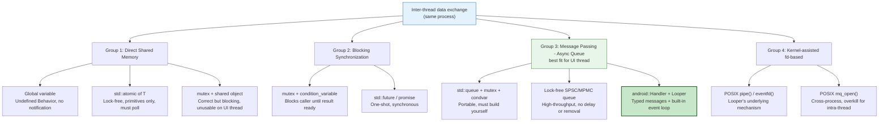

**Why Groups 1 and 2 are insufficient for the UI thread?**

Global variable: `g_result = fetch_data()` — Thread B has no idea when data is ready. Must busy-poll (`while (!ready) {}`) → burns CPU. Adding a mutex fixes the race condition but still provides no notification. Adding `condition_variable` means you are rebuilding a MessageQueue from scratch.

Mutex + condvar: Correct for **synchronous, blocking wait** — one thread waits for another to finish. Not suitable for the UI thread because the Main Thread must never block: blocking > 5 seconds = ANR (Application Not Responding). The UI thread must keep processing input, vsync, and animations while waiting.

POSIX MQ (`mq_send`/`mq_receive`): Each message = 1 system call + data copy into kernel buffer + copy back to user space. Data must be serialized into fixed-size bytes. No delayed delivery, no message cancellation. Designed for cross-process IPC — overkill for intra-thread use.

**Conclusion**: The UI thread needs asynchronous, non-blocking message dispatch. Handler/Looper provides exactly that — a user-space queue with an integrated event loop, delay support, and message cancellation.

---

## 2. Three Core Components

### 2.1 MessageQueue

A user-space linked list storing `Message` objects waiting to be processed. Sorted by time (`when`) to support delayed messages. Each thread has at most one `MessageQueue`. Protected by an internal mutex — thread-safe for enqueuing from any thread.

Each `Message` carries:

| Field | Type | Meaning |
|---|---|---|
| `what` | `int` | Message type identifier — required |
| `arg1`, `arg2` | `int` | Primitive payload |
| `obj` | `Object` (Java) / `void*` | Object payload |
| `when` | `long` (nanoseconds) | Dispatch timestamp |
| `target` | `Handler*` | Which Handler will process it |
| `callback` | `Runnable` | Used when calling `post(Runnable)` |

### 2.2 Looper

An event loop running on a specific thread. Continuously pulls messages from the `MessageQueue` and dispatches them to a `Handler`. When the queue is empty, the Looper blocks at `epoll_wait()` on an `eventfd` — no CPU burn. When a message has a `when` in the future, `epoll_wait()` is called with a precise millisecond timeout.

```
for (;;) {
    timeout = time until next message (or -1 if none)
    epoll_wait(epoll_fd, events, MAX, timeout)   ← efficient block
    msg = queue.next()                            ← retrieve due message
    if msg == nullptr: return                     ← quit() was called
    msg.target.dispatchMessage(msg)               ← call handleMessage()
    msg.recycleUnchecked()                        ← return to object pool
}
```

The Main Thread automatically has a Looper (`Looper.prepareMainLooper()` is called by `ActivityThread.main()`). Background threads do not — they must create one manually via `Looper.prepare()` + `Looper.loop()`.

### 2.3 Handler

A two-way bridge between the sending thread and the receiving thread:

- **Send** (from any thread): `sendMessage()` / `post()` → enqueue into the `MessageQueue` of the Looper the Handler is attached to → write to `eventfd` to wake the Looper
- **Receive** (on the Looper's thread): Looper pulls message → `dispatchMessage()` → `handleMessage()` runs on the correct thread

**The most important point**: Handler processes messages **on the thread it was created on** (more precisely: on the thread of the Looper passed to its constructor), not the thread that called `sendMessage()`.

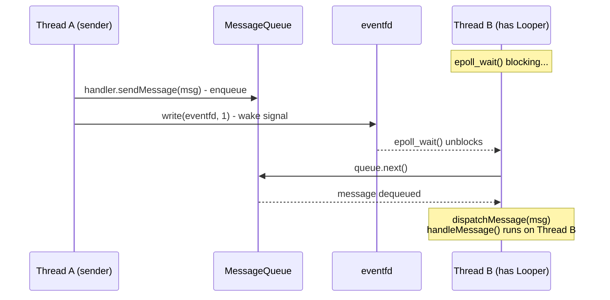

---

## 3. AOSP C++ API: `android::Handler` and `android::Looper`

The Android framework provides a C++ API in `libutils` (AOSP `system/core/libutils/`). This is the API used by system services and native components — not a JNI bridge, not pure POSIX.

**Required headers:**

```cpp
#include <utils/Looper.h>    // android::Looper, android::MessageHandler
#include <utils/RefBase.h>   // android::sp<T> (strong pointer)
```

**Main classes:**

| Class | Role | Java Equivalent |
|---|---|---|
| `android::Looper` | Event loop, manages MessageQueue | `android.os.Looper` |
| `android::MessageHandler` | Interface to receive messages, override `handleMessage()` | `android.os.Handler` |
| `android::Message` | Struct holding `what` and payload | `android.os.Message` |
| `android::sp<T>` | Smart pointer (reference counting) | — |

---

## 4. Pattern 1 — Default Looper: Same Thread, Two Handlers

The simplest case: `MySensor` sends a signal, `MyReceiver` handles it — both on the same thread, using the default Looper.

```cpp
// pattern1_default_looper.cpp
// Compile: clang++ -std=c++17 -lutils pattern1_default_looper.cpp -o p1
// (in AOSP build environment)
#include <iostream>
#include <utils/Looper.h>

using namespace android;

// Message type identifiers — equivalent to msg.what
enum EventType {
    DIAGNOSTIC_SIGNAL = 1,
    CONTROL_SIGNAL    = 2,
    STOP_SIGNAL       = 3,
};

// MySensor: creates and sends messages
// Inherits MessageHandler to use sendMessage() into the Looper
class MySensor : public MessageHandler {
public:
    // Send signal: create a Message and enqueue it into the Looper
    void sendSignal(sp<Looper> looper, EventType event, int data) {
        Message msg(event);     // msg.what = event
        msg.arg1 = data;
        looper->sendMessage(this, msg);  // Enqueue into the Looper
    }

    // Sensor's handleMessage() is a no-op — Sensor only sends
    void handleMessage(const Message& msg) override {}
};

// MyReceiver: receives and processes messages
class MyReceiver : public MessageHandler {
public:
    void handleMessage(const Message& msg) override {
        EventType event = static_cast<EventType>(msg.what);
        int data = msg.arg1;
        switch (event) {
            case DIAGNOSTIC_SIGNAL:
                std::cout << "[Receiver] DIAGNOSTIC_SIGNAL, data=" << data << "\n";
                break;
            case CONTROL_SIGNAL:
                std::cout << "[Receiver] CONTROL_SIGNAL, data=" << data << "\n";
                break;
            case STOP_SIGNAL:
                std::cout << "[Receiver] STOP_SIGNAL, data=" << data << "\n";
                break;
            default:
                std::cout << "[Receiver] UNKNOWN, data=" << data << "\n";
        }
    }
};

int main() {
    // Create Looper and two Handlers — same Looper → same MessageQueue
    sp<Looper> looper = new Looper(/*allowNonCallbacks=*/false);

    sp<MySensor>   sensor   = new MySensor();
    sp<MyReceiver> receiver = new MyReceiver();

    // Sensor sends — but messages are routed to receiver's handler.
    // Routing is determined by the MessageHandler* passed to sendMessage().
    looper->sendMessage(receiver, Message(DIAGNOSTIC_SIGNAL));
    looper->sendMessage(receiver, Message(CONTROL_SIGNAL));
    looper->sendMessage(receiver, Message(STOP_SIGNAL));

    // Poll to dispatch all pending messages (-1 = block until a message arrives)
    // pollOnce() returns after dispatching one message
    for (int i = 0; i < 3; ++i) {
        looper->pollOnce(-1);
    }
    return 0;
}
```

**Output:**

```
[Receiver] DIAGNOSTIC_SIGNAL, data=0
[Receiver] CONTROL_SIGNAL, data=0
[Receiver] STOP_SIGNAL, data=0
```

**Key structure:** `looper->sendMessage(handler, msg)` — the first parameter is the `MessageHandler*` that receives the message. The message is enqueued into the `looper`'s queue and when dispatched, `handler->handleMessage(msg)` is called. This is how AOSP routes messages to the correct handler.

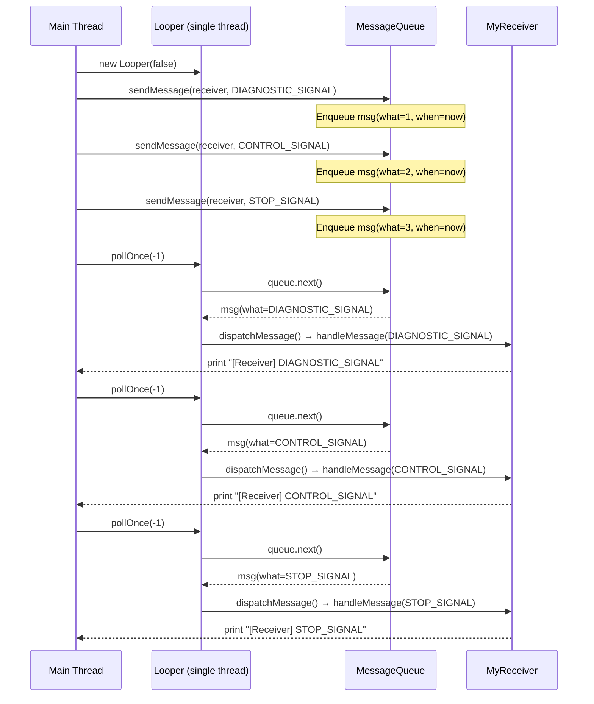

---

## 5. Pattern 2 — Custom Looper: Two Threads, Shared Looper

The realistic case: a Sensor runs on a background thread sending data, a Receiver runs on another thread processing it. Both share the same `Looper` created on the main thread.

```cpp
// pattern2_custom_looper.cpp
#include <iostream>
#include <utils/Looper.h>
#include <thread>
#include <chrono>

using namespace android;

enum EventType {
    DIAGNOSTIC_SIGNAL = 1,
    CONTROL_SIGNAL    = 2,
    STOP_SIGNAL       = 3,
};

// MySensor: sends messages — runs on the sensor thread
class MySensor : public MessageHandler {
    sp<Looper>         looper_;  // Shared looper — same looper as Receiver
    sp<MessageHandler> target_;  // Handler that will receive messages (MyReceiver)
public:
    MySensor(sp<Looper> looper, sp<MessageHandler> target)
        : looper_(looper), target_(target) {}

    void sendSignal(EventType event, int data) {
        Message msg(event);
        msg.arg1 = data;
        // Send to target_ handler — Receiver will call handleMessage()
        looper_->sendMessage(target_, msg);
        std::cout << "[Sensor  ] Sent event=" << event << " data=" << data << "\n";
    }

    void handleMessage(const Message& msg) override {}
};

// MyReceiver: receives messages — runs on the receiver thread
class MyReceiver : public MessageHandler {
public:
    void handleMessage(const Message& msg) override {
        EventType event = static_cast<EventType>(msg.what);
        int data = msg.arg1;
        switch (event) {
            case DIAGNOSTIC_SIGNAL:
                std::cout << "[Receiver] DIAGNOSTIC_SIGNAL, data=" << data << "\n";
                break;
            case CONTROL_SIGNAL:
                std::cout << "[Receiver] CONTROL_SIGNAL, data=" << data << "\n";
                break;
            case STOP_SIGNAL:
                std::cout << "[Receiver] STOP_SIGNAL, data=" << data << "\n";
                break;
        }
    }
};

// Sensor thread: sends 3 signals then exits
void runSensor(sp<Looper> looper, sp<MessageHandler> receiver) {
    MySensor sensor(looper, receiver);
    sensor.sendSignal(DIAGNOSTIC_SIGNAL, 123);
    sensor.sendSignal(CONTROL_SIGNAL,    456);
    sensor.sendSignal(STOP_SIGNAL,       789);
}

// Receiver thread: polls the Looper to receive and dispatch messages
void runReceiver(sp<Looper> looper, int messageCount) {
    // pollOnce(-1): block until at least 1 message arrives → dispatch → return
    for (int i = 0; i < messageCount; ++i) {
        looper->pollOnce(-1);
    }
}

int main() {
    // Looper created on the main thread, shared between both threads
    sp<Looper> looper = new Looper(false);

    // Receiver created first — needs to be passed to sensor as target
    sp<MyReceiver> receiver = new MyReceiver();

    // Both threads share the same looper
    std::thread sensorThread(runSensor,   looper, receiver);
    std::thread receiverThread(runReceiver, looper, 3);

    sensorThread.join();
    receiverThread.join();
    return 0;
}
```

**Output (order may vary depending on scheduling, but dispatch is always to the correct handler):**

```
[Sensor  ] Sent event=1 data=123
[Sensor  ] Sent event=2 data=456
[Sensor  ] Sent event=3 data=789
[Receiver] DIAGNOSTIC_SIGNAL, data=123
[Receiver] CONTROL_SIGNAL, data=456
[Receiver] STOP_SIGNAL, data=789
```

**Key point:** Sensor and Receiver run on two different threads but share the same `sp<Looper>`. `sendMessage()` enqueues thread-safely into the Looper's queue. `pollOnce()` on the receiver thread pulls the message out and calls `handleMessage()` — guaranteeing that `handleMessage` runs on the correct receiver thread.

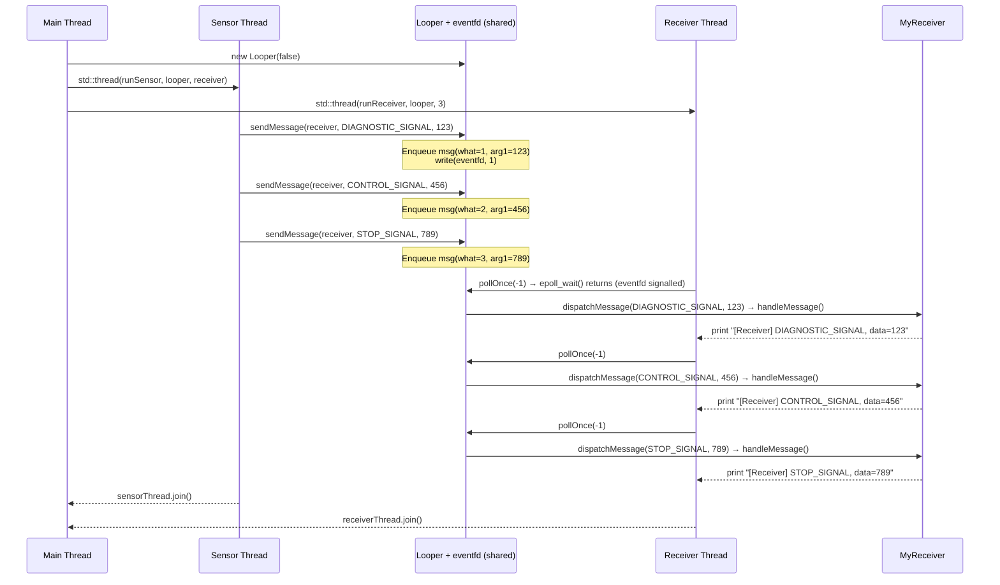

---

## 6. Pattern 3 — Delayed Message and Message Removal

`postDelayed` and `removeCallbacks` are two features Handler/Looper provides that mutex+condvar and POSIX MQ do not.

```cpp
// pattern3_delayed.cpp
#include <iostream>
#include <utils/Looper.h>
#include <thread>
#include <chrono>

using namespace android;

enum EventType {
    HEARTBEAT   = 1,
    RETRY       = 2,
    TIMEOUT     = 3,
};

class MyHandler : public MessageHandler {
    sp<Looper> looper_;
    bool       stopped_{false};
public:
    explicit MyHandler(sp<Looper> looper) : looper_(looper) {}

    void scheduleHeartbeat(int intervalMs) {
        // Send HEARTBEAT after intervalMs — equivalent to postDelayed()
        looper_->sendMessageDelayed(
            static_cast<nsecs_t>(intervalMs) * 1'000'000LL,  // nanoseconds
            this,
            Message(HEARTBEAT)
        );
    }

    void scheduleRetry(int delayMs) {
        looper_->sendMessageDelayed(
            static_cast<nsecs_t>(delayMs) * 1'000'000LL,
            this,
            Message(RETRY)
        );
    }

    void cancelRetry() {
        // Remove all pending RETRY messages — equivalent to removeMessages()
        looper_->removeMessages(this, RETRY);
        std::cout << "[Handler ] RETRY messages cancelled\n";
    }

    void stop() {
        stopped_ = true;
        looper_->removeMessages(this);  // Remove all pending messages for this handler
    }

    void handleMessage(const Message& msg) override {
        if (stopped_) return;
        switch (msg.what) {
            case HEARTBEAT:
                std::cout << "[Handler ] HEARTBEAT received\n";
                if (!stopped_) scheduleHeartbeat(500); // Self-reschedule
                break;
            case RETRY:
                std::cout << "[Handler ] RETRY executing\n";
                break;
            case TIMEOUT:
                std::cout << "[Handler ] TIMEOUT — stopping\n";
                stop();
                break;
        }
    }
};

int main() {
    sp<Looper> looper = new Looper(false);
    sp<MyHandler> handler = new MyHandler(looper);

    // Schedule heartbeat every 500ms
    handler->scheduleHeartbeat(500);

    // Schedule retry after 300ms — will be cancelled before it fires
    handler->scheduleRetry(300);

    // Timeout after 1.2 seconds — stops everything
    looper->sendMessageDelayed(1'200'000'000LL, handler, Message(TIMEOUT));

    std::cout << "[Main    ] Cancelling RETRY before it fires...\n";
    std::this_thread::sleep_for(std::chrono::milliseconds(100));
    handler->cancelRetry(); // RETRY cancelled because 300ms has not elapsed yet

    // Event loop — runs until stop() is called from the TIMEOUT handler
    while (true) {
        int result = looper->pollOnce(2000); // 2 second timeout
        if (result == Looper::POLL_TIMEOUT) break;
        // POLL_CALLBACK = message dispatched, continue polling
    }
    return 0;
}
```

**Output:**

```
[Main    ] Cancelling RETRY before it fires...
[Handler ] RETRY messages cancelled
[Handler ] HEARTBEAT received       ← t=500ms
[Handler ] HEARTBEAT received       ← t=1000ms
[Handler ] TIMEOUT — stopping       ← t=1200ms
```

**Comparison with POSIX MQ:** `mq_send` does not support delayed send or cancellation of already-sent messages. Handler/Looper supports both — this is the main reason Android does not use POSIX MQ for intra-thread messaging.

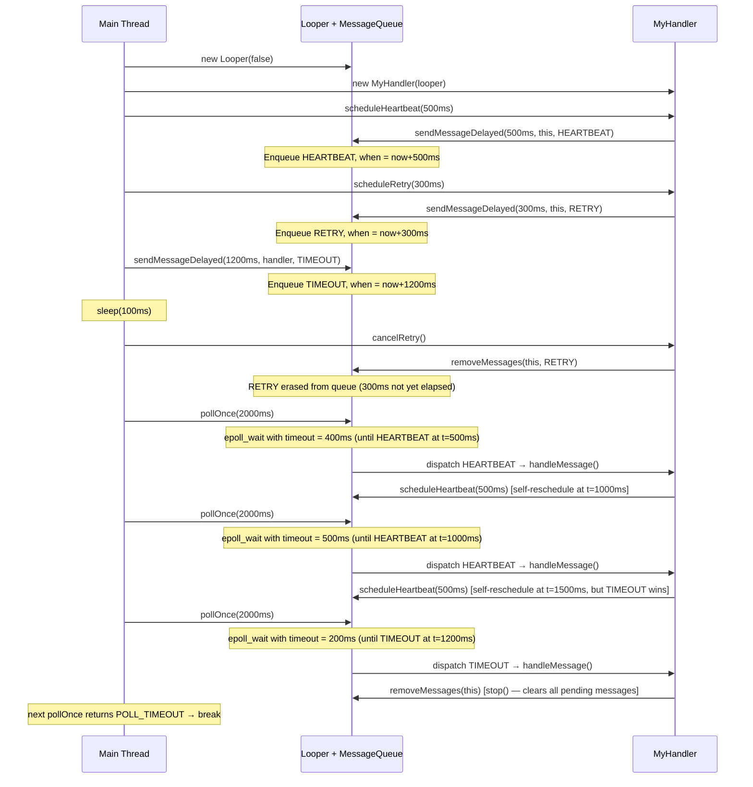

---

## 7. Pattern 4 — HandlerThread: Background Thread with Event Loop

`HandlerThread` is a Thread subclass that automatically sets up a Looper — no need to call `Looper.prepare()` and `Looper.loop()` manually. This is the standard pattern for creating a background thread capable of receiving messages.

```cpp
// pattern4_handler_thread.cpp
// C++ equivalent of HandlerThread using android::Looper

#include <iostream>
#include <utils/Looper.h>
#include <thread>
#include <future>
#include <atomic>
#include <functional>
#include <mutex>
#include <queue>

using namespace android;

// HandlerThread: background thread that automatically sets up a Looper
// Equivalent to android.os.HandlerThread
class HandlerThread {
    std::string   name_;
    std::thread   thread_;
    sp<Looper>    looper_;
    std::promise<sp<Looper>> looper_promise_; // signals when looper is ready
    std::atomic<bool> running_{false};

public:
    explicit HandlerThread(std::string name) : name_(std::move(name)) {}

    // Start the thread and block until the Looper is ready.
    // Equivalent to HandlerThread.start() + getLooper() (getLooper() blocks internally)
    sp<Looper> start() {
        auto looper_future = looper_promise_.get_future();
        thread_ = std::thread([this] { thread_body(); });
        return looper_future.get(); // blocks until Looper is ready
    }

    // Equivalent to HandlerThread.quitSafely()
    void quit_safely() {
        if (looper_ != nullptr) {
            running_ = false;
            looper_->wake(); // unblock pollOnce()
        }
        if (thread_.joinable()) thread_.join();
    }

    ~HandlerThread() { quit_safely(); }

private:
    void thread_body() {
        pthread_setname_np(pthread_self(), name_.c_str());
        // Create Looper for this thread — equivalent to Looper.prepare()
        looper_ = new Looper(false);
        running_ = true;
        looper_promise_.set_value(looper_); // unblocks start()

        // Event loop — equivalent to Looper.loop()
        while (running_) {
            int result = looper_->pollOnce(-1);
            if (result == Looper::POLL_WAKE && !running_) break;
        }
    }
};

// Worker handler runs on HandlerThread
enum WorkMsg { DO_WORK = 1, REPORT_DONE = 2 };

class WorkHandler : public MessageHandler {
    sp<Looper>         worker_looper_;   // Looper of the worker thread
    sp<Looper>         caller_looper_;   // Looper to send results back to
    sp<MessageHandler> result_handler_;  // Handler receiving results on caller thread
public:
    WorkHandler(sp<Looper> wl, sp<Looper> cl, sp<MessageHandler> rh)
        : worker_looper_(wl), caller_looper_(cl), result_handler_(rh) {}

    void dispatch(int payload) {
        Message msg(DO_WORK);
        msg.arg1 = payload;
        worker_looper_->sendMessage(this, msg);
    }

    void handleMessage(const Message& msg) override {
        if (msg.what == DO_WORK) {
            std::cout << "[WorkHandler] Processing payload=" << msg.arg1 << "\n";
            std::this_thread::sleep_for(std::chrono::milliseconds(50)); // simulate work

            // Send result back to caller thread
            Message result(REPORT_DONE);
            result.arg1 = msg.arg1 * 2; // dummy result
            caller_looper_->sendMessage(result_handler_, result);
        }
    }
};

class ResultHandler : public MessageHandler {
    std::atomic<int> received_{0};
    int expected_;
    sp<Looper> main_looper_;
public:
    ResultHandler(int expected, sp<Looper> ml)
        : expected_(expected), main_looper_(ml) {}

    void handleMessage(const Message& msg) override {
        if (msg.what == REPORT_DONE) {
            std::cout << "[ResultHandler] Done: result=" << msg.arg1 << "\n";
            if (++received_ == expected_) {
                std::cout << "[ResultHandler] All work complete!\n";
                main_looper_->wake(); // unblock main thread poll
            }
        }
    }
};

int main() {
    // Main thread Looper — to receive results
    sp<Looper> main_looper = new Looper(false);

    // Background HandlerThread — where actual work runs
    HandlerThread worker_thread("worker");
    sp<Looper> worker_looper = worker_thread.start();

    sp<ResultHandler> result_handler = new ResultHandler(3, main_looper);
    sp<WorkHandler>   work_handler   = new WorkHandler(
        worker_looper, main_looper, result_handler);

    // Dispatch 3 tasks — does not block the main thread
    work_handler->dispatch(10);
    work_handler->dispatch(20);
    work_handler->dispatch(30);

    // Main thread polls until all results are returned.
    // ResultHandler will wake() main_looper when all done.
    std::cout << "[Main] Waiting for results...\n";
    for (int i = 0; i < 3; ++i) {
        main_looper->pollOnce(5000); // 5 second timeout
    }

    return 0;
}
```

**Output:**

```
[Main] Waiting for results...
[WorkHandler] Processing payload=10
[WorkHandler] Processing payload=20
[WorkHandler] Processing payload=30
[ResultHandler] Done: result=20
[ResultHandler] Done: result=40
[ResultHandler] Done: result=60
[ResultHandler] All work complete!
```

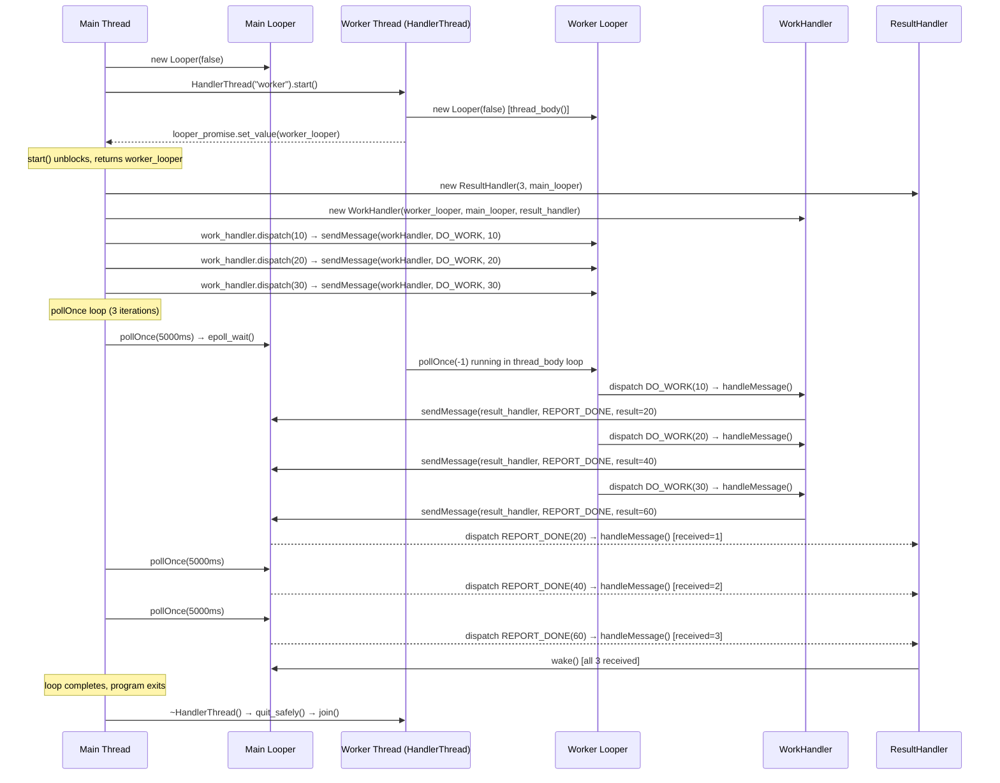

---

## 8. Message Lifecycle and Object Pool

Understanding the lifecycle of a `Message` helps avoid two common bugs: using a message after `sendMessage()`, and creating messages with `new` instead of taking from the pool.

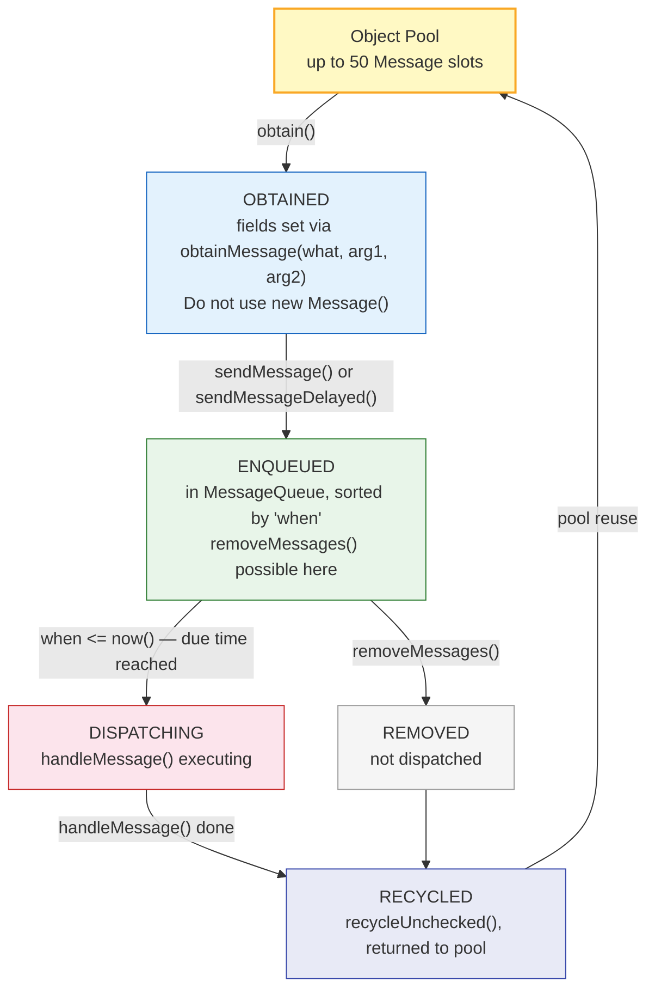

**Rule:** After calling `sendMessage(msg)` or `sendToTarget()`, the message belongs to the system — do not read from or write to it. If you need the value after sending, copy it before sending.

```cpp
// CORRECT — obtain from pool
Message msg = handler->obtainMessage(CONTROL_SIGNAL, 42, 0);
handler->sendMessage(msg);
// msg now belongs to the queue — do NOT read msg.arg1 here

// WRONG — allocate with new (not in the standard Java API, but the reason still applies)
// Each new Message() instead of obtainMessage() costs an extra allocation.
// At 60fps UI updates: 60 allocations/sec × object lifetime → increased GC pressure
```

---

## 9. `sendToTarget()` vs `sendMessage()`: When to Use Which

These two APIs are easy to confuse. The difference lies in **who the target is**:

```cpp
// sendToTarget(): send the message BACK to the handler that created it
// Use when a handler wants to post to itself
Message msg = mySensor.obtainMessage(HEARTBEAT);
msg.sendToTarget();   // → dispatched to mySensor.handleMessage()

// sendMessage(): send the message to a specific handler
// Use when routing to a different handler
Message msg = handler.obtainMessage(DIAGNOSTIC_SIGNAL, 123, 0);
looper->sendMessage(anotherHandler, msg); // → dispatched to anotherHandler.handleMessage()
```

Comparison:

| | `sendToTarget()` | `sendMessage(handler, msg)` |
|---|---|---|
| Target | Handler that created the message | Specified handler |
| Use when | Self-scheduling, heartbeat, retry | Routing to another component |
| Example | `scheduleHeartbeat()` self-reschedule | Sensor sending to Receiver |

---

## 10. Why Not Use IPC Alternatives?

A practical question: Linux has pipes, POSIX MQ, shared memory — why use Handler/Looper?

| Mechanism | Kernel? | Copies | Notify | Delay | Cancel | Typed | Intra-thread fit |
|---|---|---|---|---|---|---|---|
| Global variable | No | 0 | No | No | No | No | No — Race condition |
| mutex + condvar | No* | 0 | Yes | No | No | Yes | Partial — Blocking |
| std::future/promise | No* | 0 | Yes | No | No | Yes | Partial — One-shot only |
| POSIX pipe | Yes | 2 | Yes | No | No | No | Partial — Bytes only |
| POSIX MQ | Yes | 2 | Yes | No | No | Yes | No — Overkill + overhead |
| **Handler/Looper** | No** | 0 | Yes | Yes | Yes | Yes | **Yes — Designed for this** |

`*` futex syscall only under contention  
`**` uses eventfd to wake epoll, but data queue is user-space — no copy

**Global variable**: No notification, must busy-poll. Race condition without a mutex. A mutex fixes the race but not the notification → need condvar → you are rebuilding MessageQueue.

**mutex + condvar**: Correct for blocking synchronous wait. Cannot use on Main Thread (ANR risk). No delayed dispatch, no cancellation.

**POSIX MQ**: Each `mq_send` = syscall + copy data into kernel buffer. Each `mq_receive` = syscall + copy to user space. 2 copies + 2 syscalls per message. Data must be fixed-size bytes (cannot pass pointers/objects). No delay, no cancel.

**Handler/Looper internals**: Enqueue is user-space (mutex + linked list). Wake is 1 `write(eventfd, 1)` — 1 syscall, 8 bytes. Data is not copied — a pointer to the object is passed directly. `epoll_wait()` blocks efficiently, no CPU burn.

---

## 11. Is Handler/Looper Portable to Plain POSIX?

**`android.os.Handler` and `android::Looper` are not portable** — they are Android-specific APIs. But the underlying pattern is fully portable.

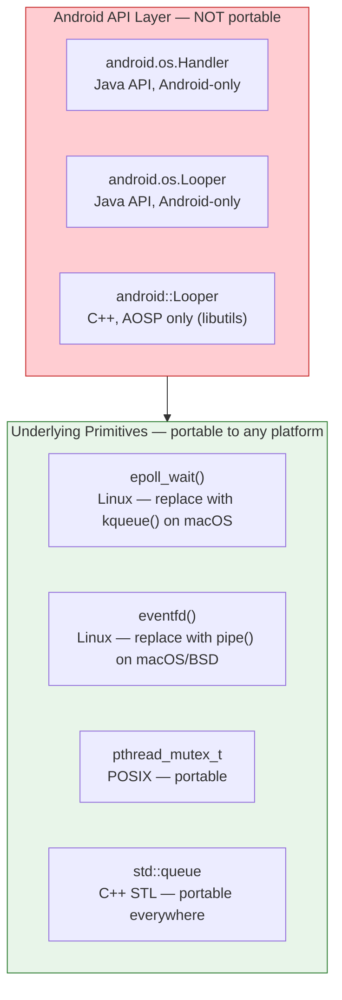

Equivalent implementation on plain Linux (no Android required) — this is also how `libuv` (the Node.js runtime) works:

```cpp
// posix_looper.cpp — runs on Linux, no Android needed
// Compile: g++ -std=c++17 -pthread posix_looper.cpp -o posix_looper
#include <sys/epoll.h>
#include <sys/eventfd.h>
#include <unistd.h>
#include <chrono>
#include <functional>
#include <mutex>
#include <vector>
#include <optional>
#include <cstdio>

struct Message {
    int what{0};
    int arg1{0};
    std::function<void()> callback;
    std::chrono::steady_clock::time_point when{std::chrono::steady_clock::now()};
};

class PosixLooper {
    int epoll_fd_, wake_fd_;
    bool running_{false};
    std::mutex mtx_;
    std::vector<Message> queue_; // sorted by 'when'

    std::function<void(const Message&)> on_message_;

public:
    PosixLooper() {
        epoll_fd_ = epoll_create1(EPOLL_CLOEXEC);
        wake_fd_  = eventfd(0, EFD_NONBLOCK | EFD_CLOEXEC);
        epoll_event ev{.events = EPOLLIN, .data = {.fd = wake_fd_}};
        epoll_ctl(epoll_fd_, EPOLL_CTL_ADD, wake_fd_, &ev);
    }
    ~PosixLooper() { close(wake_fd_); close(epoll_fd_); }

    void set_handler(std::function<void(const Message&)> h) { on_message_ = h; }

    // Equivalent to Looper.loop()
    void loop() {
        running_ = true;
        while (running_) {
            int timeout = next_timeout_ms();
            epoll_event ev[4];
            int n = epoll_wait(epoll_fd_, ev, 4, timeout);
            if (n < 0 && errno == EINTR) continue;
            for (int i = 0; i < n; ++i)
                if (ev[i].data.fd == wake_fd_) {
                    uint64_t v; read(wake_fd_, &v, sizeof(v));
                }
            dispatch_due();
        }
    }

    void quit() { running_ = false; wake(); }

    // Equivalent to sendMessage()
    void send(Message msg, std::chrono::milliseconds delay = {}) {
        msg.when = std::chrono::steady_clock::now() + delay;
        std::lock_guard<std::mutex> lk(mtx_);
        auto it = queue_.begin();
        while (it != queue_.end() && it->when <= msg.when) ++it;
        queue_.insert(it, std::move(msg));
        wake();
    }

    // Equivalent to removeMessages()
    void remove(int what) {
        std::lock_guard<std::mutex> lk(mtx_);
        queue_.erase(std::remove_if(queue_.begin(), queue_.end(),
            [what](const Message& m) { return m.what == what; }), queue_.end());
    }

private:
    void wake() { uint64_t v = 1; write(wake_fd_, &v, sizeof(v)); }

    int next_timeout_ms() {
        std::lock_guard<std::mutex> lk(mtx_);
        if (queue_.empty()) return -1;
        auto now = std::chrono::steady_clock::now();
        if (queue_.front().when <= now) return 0;
        return (int)std::chrono::duration_cast<std::chrono::milliseconds>(
            queue_.front().when - now).count();
    }

    void dispatch_due() {
        auto now = std::chrono::steady_clock::now();
        while (true) {
            std::optional<Message> msg;
            {
                std::lock_guard<std::mutex> lk(mtx_);
                if (queue_.empty() || queue_.front().when > now) break;
                msg = std::move(queue_.front());
                queue_.erase(queue_.begin());
            }
            if (msg->callback) msg->callback();
            else if (on_message_) on_message_(*msg);
        }
    }
};

enum { PING = 1, STOP = 2 };

int main() {
    PosixLooper looper;
    int ping_count = 0;

    looper.set_handler([&](const Message& msg) {
        if (msg.what == PING) {
            printf("[Looper] PING #%d received\n", ++ping_count);
            if (ping_count < 3) {
                Message next; next.what = PING;
                looper.send(next, std::chrono::milliseconds{200});
            } else {
                Message stop; stop.what = STOP;
                looper.send(stop);
            }
        } else if (msg.what == STOP) {
            printf("[Looper] STOP — quitting\n");
            looper.quit();
        }
    });

    Message first; first.what = PING;
    looper.send(first, std::chrono::milliseconds{100});

    looper.loop(); // blocking
    return 0;
}
```

**Output:**

```
[Looper] PING #1 received
[Looper] PING #2 received
[Looper] PING #3 received
[Looper] STOP — quitting
```

On macOS/BSD: replace `epoll_create1`/`epoll_wait` with `kqueue()`/`kevent()`. Cross-platform: use `libuv` — that library implements exactly this pattern (eventfd/kqueue/IOCP per platform) and is the foundation of the Node.js event loop.

---

## 12. Practical Pitfalls

### 12.1 Using a Message after sendMessage() — Use-after-recycle

```cpp
// DANGEROUS — msg is recycled; reading arg1 is undefined behavior
Message msg = handler->obtainMessage(DATA_READY, 42, 0);
handler->sendMessage(msg);
printf("sent data=%d\n", msg.arg1); // arg1 may already be recycled, random value

// CORRECT — copy the value before sending
int payload = 42;
handler->sendMessage(handler->obtainMessage(DATA_READY, payload, 0));
printf("sent data=%d\n", payload); // reading from local copy, safe
```

### 12.2 Dangling pointer in closure capture (C++)

```cpp
// DANGEROUS — raw 'this' may dangle
class Sensor : public MessageHandler {
    HandlerThread worker_;
    void start() {
        sp<Looper> looper = worker_.start();
        looper->sendMessage(this, Message(START)); // raw 'this' pointer
        // If Sensor is destroyed before message is dispatched → crash
    }
};

// SAFE — use sp<> (strong pointer) to guarantee lifetime
class Sensor : public RefBase, public MessageHandler {
    void start(sp<Looper> looper) {
        looper->sendMessage(sp<Sensor>(this), Message(START)); // sp<> keeps Sensor alive
    }
};
```

### 12.3 pollOnce() called from the wrong thread

```cpp
// DANGEROUS — pollOnce() called from a different thread than the one that created the Looper
sp<Looper> looper = new Looper(false);

std::thread t([&looper] {
    looper->pollOnce(-1); // OK if looper is not bound to a specific thread
});
// With android::Looper: pollOnce() may be called from any thread BUT
// handleMessage() runs on the thread calling pollOnce(), not the thread that created the Looper
// → Must be clear: whichever thread calls pollOnce(), handleMessage() runs there

// CORRECT PATTERN: always call pollOnce() in the event loop of the destination thread
void receiver_thread_body(sp<Looper> looper) {
    while (running) looper->pollOnce(-1); // all dispatch happens on this thread
}
```

### 12.4 Forgetting quit() — thread and Looper leak

```cpp
// DANGEROUS — HandlerThread not quit before owner is destroyed
class MyComponent {
    HandlerThread worker_;
    sp<Looper> looper_;
public:
    MyComponent() { looper_ = worker_.start(); }
    ~MyComponent() {
        // BUG: worker_ thread is still blocked in looper->pollOnce(-1)
        // Thread cannot exit, destructor hangs
    }
};

// SAFE — quit before join
class MyComponent {
    HandlerThread worker_;
    sp<Looper> looper_;
public:
    MyComponent() { looper_ = worker_.start(); }
    ~MyComponent() {
        worker_.quit_safely(); // drain queue → break loop → thread join
    }
};
```

---

## 13. Handler/Looper in the Modern Android Ecosystem

Handler/Looper is not replaced by higher-level abstractions — those abstractions are built on top of it:

| High-level API | What it uses underneath |
|---|---|
| `View.post(Runnable)` | `ViewRootImpl`'s Handler |
| `Activity.runOnUiThread()` | `mHandler.post()` if not on main thread |
| `LiveData.postValue()` | `ArchTaskExecutor` → Handler → Main Looper |
| `Dispatchers.Main` (Coroutines) | `HandlerContext` wrapping Main Looper |
| `WorkManager` | `CoroutineWorker` on `Dispatchers.IO` |

When you write `withContext(Dispatchers.Main) { textView.text = result }`, the Kotlin runtime enqueues a coroutine continuation into the Main Thread's `MessageQueue` via `HandlerContext`. This is `handler.post()` with nicer syntax — same mechanism, different surface.

---

Three points to take away from this post:

**First**: Handler/Looper solves the exact UI thread problem — asynchronous dispatch without requiring the caller to block. Global variables, mutex+condvar, and POSIX MQ all solve different problems and each has specific trade-offs that make them unsuitable here.

**Second**: `handleMessage()` runs on the thread that calls `pollOnce()`, not the thread that calls `sendMessage()`. This is the single most common source of confusion. Understanding this clearly means understanding the entire mechanism.

**Third**: The pattern is portable — epoll+eventfd+user-space queue — but the API (`android::Looper`, `android.os.Handler`) is not. For portability: implement with `libuv` or `kqueue` on macOS.

Next practical step: read `system/core/libutils/Looper.cpp` in AOSP (~600 lines of C++). Then run `PosixLooper` from Section 11 on Linux to confirm the mechanism does not depend on the Android framework.

---

## Appendix: Diagrams

### Diagram 1: Overall architecture — three components and thread boundary

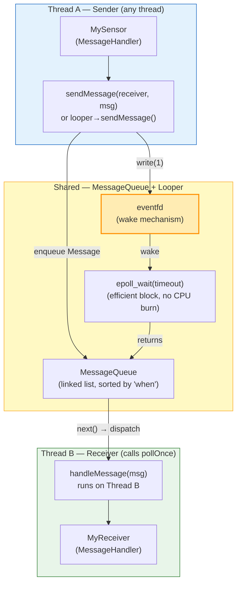


### Diagram 2: sendMessage() vs sendToTarget() — routing

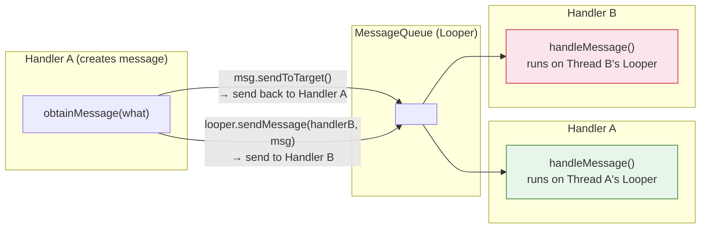

### Diagram 3: IPC mechanisms — overhead comparison

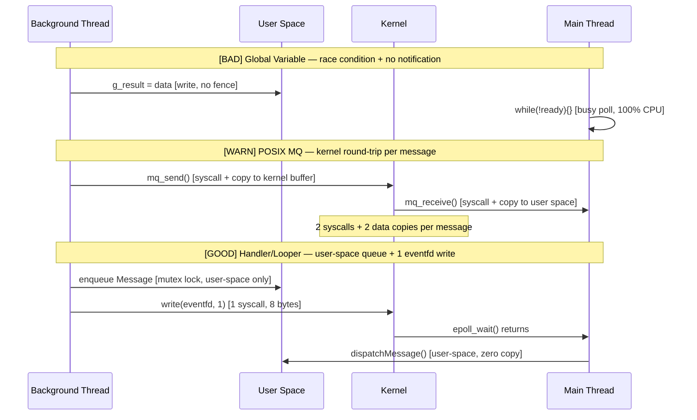

### Diagram 4: Decision tree — when to use which mechanism

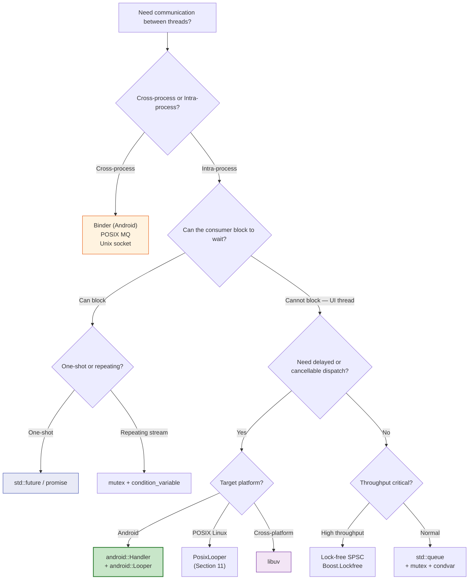
