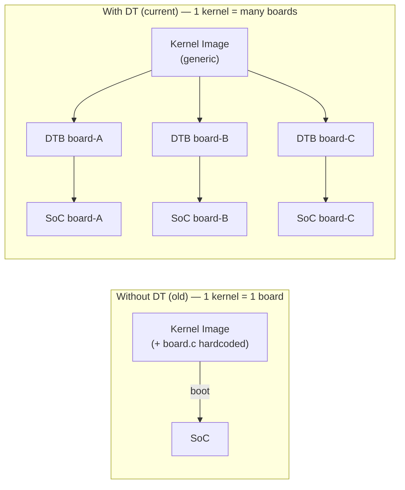
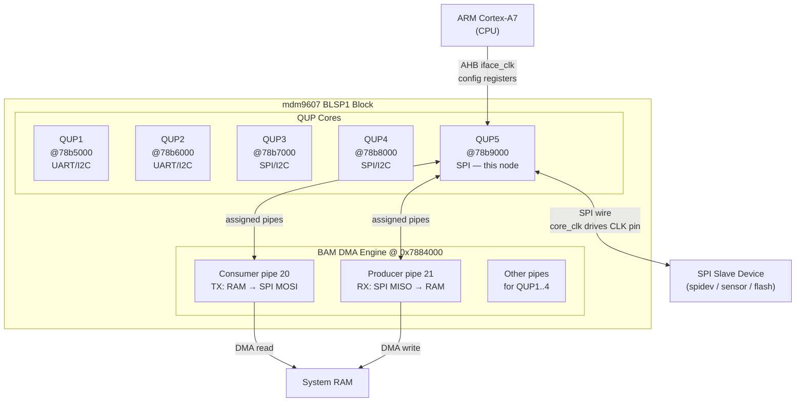
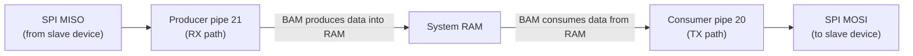
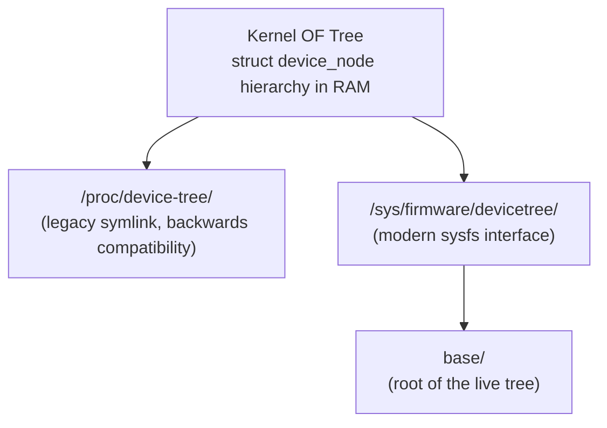
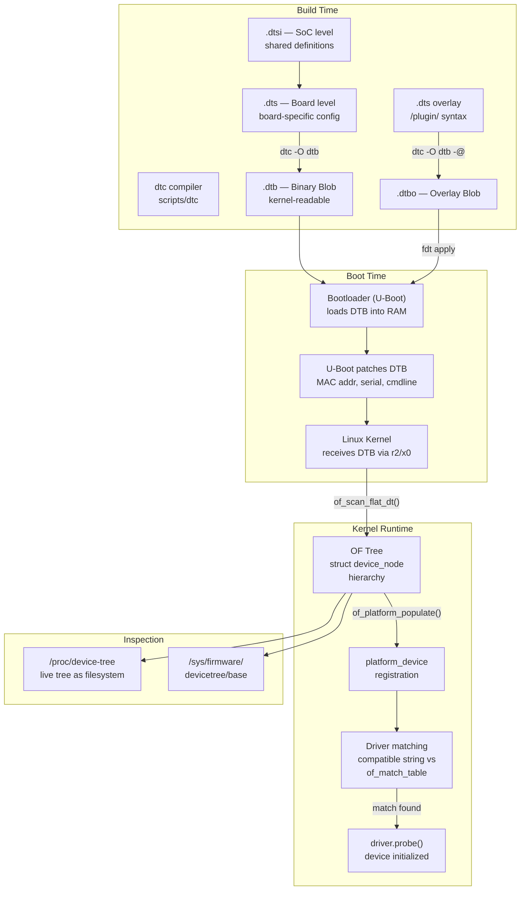
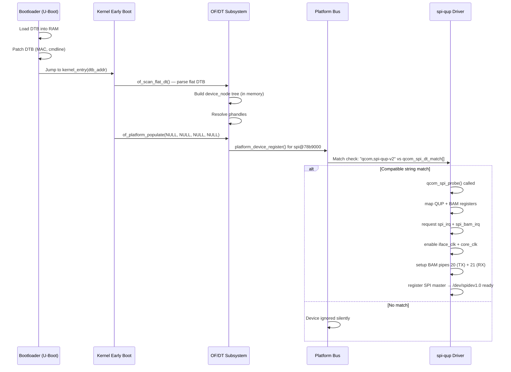
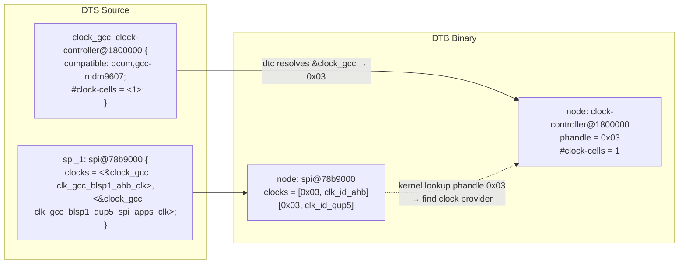
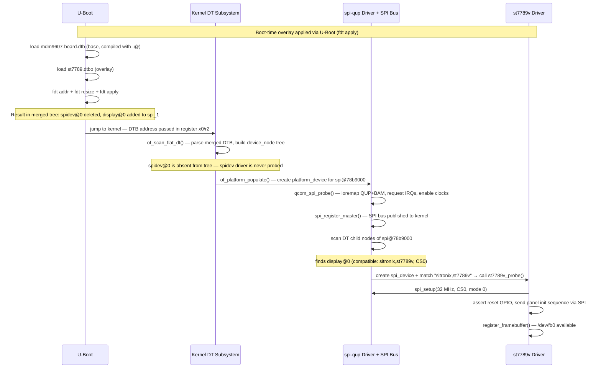
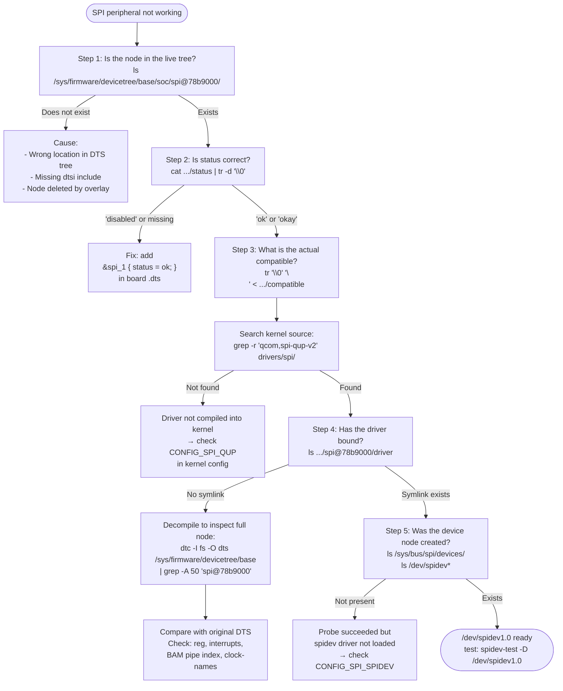

You are working with a new ARM board. You compile the kernel, flash it, reboot — and the SPI bus does not work. No obvious error in `dmesg`. The driver is compiled into the kernel. The hardware is wired correctly. So where is the problem?

The answer is almost always: **a wrong Device Tree**.

This is the type of bug that wastes hours for engineers new to embedded Linux — not because it is hard, but because no one clearly explains what Device Tree is, what it does, and why a small text file has the power to completely "turn off" a peripheral from the kernel's perspective.

This post explains Device Tree from the ground up: why it exists, the syntax structure, the flow from DTS to driver probe, and a complete use case — analyzing a real SPI node on the Qualcomm mdm9607 (BLSP1 QUP5 + BAM DMA). After reading this you will know how to read and write DTS for any peripheral.

---

## 1. The Problem Device Tree Was Created to Solve

On x86 PCs, when you plug in a PCIe card, the OS discovers it automatically through enumeration. ACPI, PCI, and BIOS/UEFI handle the "conversation" with the device and inform the OS what exists.

On most ARM SoCs — found in routers, cameras, automobiles, and ECUs — this model does not exist. Peripherals are hardwired to fixed addresses. The SPI controller is at address `0x78b9000`. The interrupt controller is at `0x10000000`. There is no way to ask "who are you?", because buses like I2C, SPI, and UART do not support enumeration.

The old solution: **hardcode directly into the kernel source**. Each board had a `board_xyz.c` file containing addresses, interrupts, and configurations. When the ARM ecosystem started exploding in the mid-2000s, the Linux kernel recognized that the growth rate of board support files was unsustainable — each board vendor submitted a pile of `board_xxx.c` files into mainline.

In 2005, starting with PowerPC, the **Flattened Device Tree (FDT)** solution was standardized: describe hardware in a separate data file, not in the kernel source. The bootloader passes this file to the kernel at boot time. The kernel reads it and learns what the hardware looks like — without needing to recompile.



Result: a single kernel image can boot on dozens of different board variants — just swap the corresponding DTB file.

---

## 2. What Is Device Tree — Technical Definition

**Device Tree** is a tree-shaped data structure that describes the hardware of a system so that the operating system can use and manage those components — including CPU, memory, buses, and peripherals.

It exists in the following file formats:


| Format | Description |
|---|---|
| `.dts` | Device Tree Source — the text file you write, describes board-level hardware |
| `.dtsi` | Device Tree Source Include — SoC-level description, shared across multiple boards |
| `.dtb` | Device Tree Blob — binary that the kernel reads, loaded into RAM by the bootloader |
| `.dtbo` | Device Tree Blob Overlay — binary overlay applied on top of DTB at runtime |
| `dtc` | Device Tree Compiler — tool that compiles DTS → DTB (`scripts/dtc` in the kernel tree) |

The Device Tree specification is maintained by **devicetree.org**, affiliated with Linaro and Arm. Currently at **version 0.4**.

---

## 3. Syntax Structure and Components

Device Tree has a structure like a directory tree — each **node** is a device or bus, and each **property** is a key-value pair describing a characteristic.

### 3.1 Basic Structure

```c
/dts-v1/;

/ {                                    /* Root node */
    model = "My Custom Board v1.0";
    compatible = "myvendor,myboard", "myvendor,my-soc";
    #address-cells = <1>;
    #size-cells = <1>;

    cpus {
        #address-cells = <1>;
        #size-cells = <0>;
        cpu@0 {
            compatible = "arm,cortex-a53";
            device_type = "cpu";
            reg = <0>;                 /* CPU index */
        };
    };

    memory@80000000 {
        device_type = "memory";
        reg = <0x80000000 0x20000000>; /* 512 MB at 0x80000000 */
    };

    chosen {
        bootargs = "console=ttyS0,115200 root=/dev/mmcblk0p2";
    };

    soc {
        compatible = "simple-bus";
        #address-cells = <1>;
        #size-cells = <1>;
        ranges;                        /* pass-through address mapping */

        uart0: serial@40000000 {
            compatible = "myvendor,uart";
            reg = <0x40000000 0x1000>;
            interrupts = <5>;
            status = "okay";
        };

        i2c0: i2c@40010000 {
            compatible = "myvendor,i2c";
            reg = <0x40010000 0x1000>;
            interrupts = <7>;
            #address-cells = <1>;
            #size-cells = <0>;
            status = "okay";

            temp_sensor: lm75@48 {     /* Temperature sensor on I2C bus */
                compatible = "lm75";
                reg = <0x48>;          /* I2C address */
            };
        };
    };
};
```

### 3.2 The Most Important Properties

The table below covers the properties you will encounter in 90% of cases:

| Property | Meaning |
|---|---|
| `compatible` | String matching the node to a driver. List prioritized left to right (specific → generic) |
| `reg` | Base address and size of the register region |
| `interrupts` | Interrupt number (cell count depends on `#interrupt-cells`) |
| `interrupt-parent` | Phandle pointing to the interrupt controller |
| `status` | `"okay"`/`"ok"` = enabled, `"disabled"` = off, kernel ignores |
| `#address-cells` | Number of cells to encode a child node's address |
| `#size-cells` | Number of cells to encode a child node's size |
| `ranges` | Address mapping parent ↔ child. `ranges;` = pass-through |
| `clocks` | Phandle to clock source |
| `clock-names` | Alias names for each clock (driver uses these to request) |
| `pinctrl-N` | Phandle to pinmux configuration for state N |
| `pinctrl-names` | Names of each pinctrl state |
| `gpios` | Phandle to GPIO controller + GPIO number + flags |

### 3.3 Phandle — The Cross-Node Reference Mechanism

A phandle is the mechanism for one node to "reference" another node. This is the concept that confuses most newcomers.

```c
/ {
    /* Declare interrupt controller with label "intc" */
    intc: interrupt-controller@10000000 {
        compatible = "arm,gic-v2";
        interrupt-controller;          /* boolean: this is an interrupt controller */
        #interrupt-cells = <3>;        /* each interrupt requires 3 cells to describe */
        reg = <0x10000000 0x1000>;
    };

    soc {
        uart0: serial@40000000 {
            interrupt-parent = <&intc>; /* &intc → phandle of the intc node */
            interrupts = <0 5 4>;       /* 3 cells because #interrupt-cells = 3 */
                                        /* [type] [irq_number] [flags]          */
        };
    };
};
```

In the DTB binary, `<&intc>` is replaced by the compiler with an integer (the phandle number). The kernel uses this number to look up the node.

**Hierarchical interrupt-parent lookup:** If a node does not have `interrupt-parent`, the kernel searches up through parent nodes until it finds one or reaches the root. This is why `interrupt-parent` is commonly declared once at the root or SoC node.

### 3.4 File Organization: DTS and DTSI

In practice, Device Tree is organized across multiple files:

```
arch/arm64/boot/dts/
└── myvendor/
    ├── my-soc.dtsi          ← Describes the SoC (shared across multiple boards)
    ├── my-soc-pinctrl.dtsi  ← Pinmux definitions
    ├── board-basic.dts      ← Board A (includes dtsi, enables peripherals)
    └── board-premium.dts    ← Board B (same SoC, different peripherals)
```

The `.dtsi` file describes the SoC hardware — all peripherals, but typically with `status = "disabled"`. The board-specific `.dts` file includes the DTSI and enables only what is actually present on that board:

```c
/* board-basic.dts */
/dts-v1/;
#include "my-soc.dtsi"

/ {
    model = "My Basic Board";
    compatible = "myvendor,basic-board", "myvendor,my-soc";
};

/* Enable UART0 (declared in dtsi but disabled) */
&uart0 {
    status = "okay";
};

/* Enable I2C and add peripheral */
&i2c0 {
    status = "okay";
    lm75@48 {
        compatible = "lm75";
        reg = <0x48>;
    };
};
```

---

## 4. The Boot Process — From DTS to Driver Probe

Understanding this flow means understanding why Device Tree matters so much:

```
Build time:
  DTS + DTSI ──[dtc]──> DTB (.dtb binary)

Boot time:
  1. Bootloader (U-Boot) loads DTB into RAM
  2. U-Boot may patch DTB (add MAC address, serial number, cmdline)
  3. U-Boot passes DTB address via register r2/x0 before jumping to the kernel

Kernel startup:
  4. early boot: of_scan_flat_dt() — parse DTB into internal OF tree
     (struct device_node hierarchy)
  5. of_platform_populate() — walk the tree, create platform_device for each
     node that has a compatible string
  6. Driver matching: kernel compares compatible string in DTB
     against of_match_table[] in the driver
  7. If match → driver probe() is called → device is initialized

Runtime inspection:
  /sys/firmware/devicetree/base/  ← live device tree (filesystem view)
  /proc/device-tree/              ← symlink to the above
```

**The most important point:** If the DTB is semantically wrong, the kernel will **silently ignore** the hardware — no error, driver does not probe. This is why Device Tree bugs are so hard to debug without knowing the mechanism.

### 4.1 Driver Matching via Compatible String

```c
/* In driver C code — spi-qup.c as example */
static const struct of_device_id qcom_spi_dt_match[] = {
    { .compatible = "qcom,spi-qup-v1" },
    { .compatible = "qcom,spi-qup-v2" },
    { /* sentinel — required */ }
};
MODULE_DEVICE_TABLE(of, qcom_spi_dt_match);

static struct platform_driver qcom_spi_driver = {
    .probe  = qcom_spi_probe,
    .remove = qcom_spi_remove,
    .driver = {
        .name           = "spi_qup",
        .of_match_table = qcom_spi_dt_match,
    },
};
```

The kernel compares `compatible` in the DTB against each entry in `of_match_table`. If there is no match → driver does not probe → device does not work, no error message.

---

## 5. Real-World Use Case: SPI Controller on Qualcomm mdm9607

This is the complete DTS node configuring **BLSP1 QUP5** as an SPI master on the mdm9607, with BAM DMA and a `spidev` userspace device:

```c
spi_1: spi@78b9000 {
    compatible = "qcom,spi-qup-v2";

    reg-names = "spi_physical", "spi_bam_physical";
    reg = <0x78b9000 0x600>, <0x7884000 0x2b000>;

    interrupts = <0 99 0>, <0 238 0>;
    interrupt-names = "spi_irq", "spi_bam_irq";

    spi-max-frequency = <19200000>;

    pinctrl-names = "spi_default", "spi_sleep";
    pinctrl-0 = <&spi1_default &spi1_cs0_active>;
    pinctrl-1 = <&spi1_sleep &spi1_cs0_sleep>;

    clocks = <&clock_gcc clk_gcc_blsp1_ahb_clk>,
             <&clock_gcc clk_gcc_blsp1_qup5_spi_apps_clk>;
    clock-names = "iface_clk", "core_clk";

    qcom,infinite-mode = <0>;
    qcom,use-bam;
    qcom,use-pinctrl;
    qcom,ver-reg-exists;
    qcom,bam-consumer-pipe-index = <20>;
    qcom,bam-producer-pipe-index = <21>;
    qcom,master-id = <86>;

    status = "ok";

    spidev@0 {
        compatible = "spidev";
        spi-max-frequency = <5000000>;
        reg = <0>;
        status = "ok";
    };
};
```

### 5.1 BLSP + BAM Hardware Architecture

To understand this node, you need to know the Qualcomm BLSP (BAM-enabled Low-Speed Peripheral) hardware architecture:



BAM (Bus Access Manager) is Qualcomm's DMA engine — instead of the CPU copying each byte into the QUP FIFO (PIO mode), BAM automatically transfers data between system memory and the QUP hardware buffer.

### 5.2 Property-by-Property Analysis

**Node name and address:**

```c
spi_1: spi@78b9000
```

- `spi_1` is the label — other nodes reference it via `&spi_1`
- `@78b9000` is the unit address = base address of the QUP5 register block
- The unit address must match the first value in `reg`

---

**Compatible — Driver Matching:**

```c
compatible = "qcom,spi-qup-v2";
```

The kernel matches this node with `drivers/spi/spi-qup.c`. This is the official binding string — one wrong character → driver does not probe, no error.

---

**Register Regions — Two Memory Areas:**

```c
reg-names = "spi_physical", "spi_bam_physical";
reg = <0x78b9000 0x600>,    /* QUP5 control registers — 1.5 KB */
      <0x7884000 0x2b000>;  /* BLSP1 BAM registers   — 172 KB */
```

The driver needs to map **both** memory regions:
- `spi_physical`: QUP5 registers — control protocol, FIFO status, mode config
- `spi_bam_physical`: BAM DMA registers — setup DMA descriptor rings, pipe config

When the driver calls `platform_get_resource_byname(pdev, IORESOURCE_MEM, "spi_physical")`, the kernel looks up the entry by name from `reg-names`.

---

**Interrupts — Two Interrupt Sources:**

```c
interrupts = <0 99 0>, <0 238 0>;
interrupt-names = "spi_irq", "spi_bam_irq";
```

Format `<type irq_number flags>` per ARM GIC specification:
- `0` = SPI (Shared Peripheral Interrupt)
- `99` = GIC SPI #99 → global IRQ #131 (99 + 32)
- `238` = GIC SPI #238 → global IRQ #270
- `0` = level-triggered, active high

| Name | Purpose |
|---|---|
| `spi_irq` | QUP transaction complete, FIFO errors |
| `spi_bam_irq` | BAM DMA completion, pipe errors |

With `qcom,use-bam`, the normal data path uses `spi_bam_irq`. `spi_irq` is primarily for error handling and FIFO fallback mode.

---

**SPI Max Frequency — Controller Level:**

```c
spi-max-frequency = <19200000>;  /* 19.2 MHz */
```

This is the **controller** limit. 19.2 MHz is a multiple of the XO clock (19.2 MHz crystal oscillator) — common on Qualcomm platforms because it requires no fractional divider. The child device `spidev@0` has its own `spi-max-frequency = <5000000>` — the kernel will use the **lower** of the controller and device values.

---

**Pinctrl — Pin Management by State:**

```c
pinctrl-names = "spi_default", "spi_sleep";
pinctrl-0 = <&spi1_default &spi1_cs0_active>;
pinctrl-1 = <&spi1_sleep   &spi1_cs0_sleep>;
```

This is the standard Qualcomm power management pattern. The two phandles in `pinctrl-0` represent two separate pin groups:
- `spi1_default`: configures MOSI, MISO, CLK — active drive
- `spi1_cs0_active`: configures CS0 — active drive

When the SPI bus is idle (runtime PM suspend), the pinctrl framework automatically switches to `spi_sleep` — pins move to a low-power state (input, no-pull or pull-down). When a transaction occurs → switches back to `spi_default`. This pattern saves power and prevents floating pins from causing noise.

---

**Clocks — Two Clock Domains:**

```c
clocks = <&clock_gcc clk_gcc_blsp1_ahb_clk>,
         <&clock_gcc clk_gcc_blsp1_qup5_spi_apps_clk>;
clock-names = "iface_clk", "core_clk";
```

Qualcomm architecture separates two clock domains:

```
GCC (Global Clock Controller)
├── clk_gcc_blsp1_ahb_clk  →  "iface_clk"
│   └── AHB bus clock: CPU reads/writes QUP registers (control plane)
│       Must always be on when CPU needs to access QUP
│
└── clk_gcc_blsp1_qup5_spi_apps_clk  →  "core_clk"
    └── Functional clock: generates the SPI_CLK signal on the pin (data plane)
        Can be gated when no transfer is in progress
```

The driver must enable `iface_clk` before `core_clk`, and disable in reverse order. `spi-qup.c` handles this via `clk_prepare_enable()` / `clk_disable_unprepare()`.

---

**Qualcomm-Specific Properties:**

```c
qcom,infinite-mode = <0>;
```
`<0>` = disabled. Each DMA transfer has a clear start/stop. Keep `<0>` for normal use cases.

```c
qcom,use-bam;
```
Boolean property — enables BAM DMA. When present, the driver uses DMA for all transfers. Removing it → falls back to PIO (CPU polling FIFO byte by byte) — useful for debugging, significantly slower in production.

```c
qcom,use-pinctrl;
```
Tells the driver to use the pinctrl subsystem to manage pin states — linked to `pinctrl-0/1` above.

```c
qcom,ver-reg-exists;
```
QUP has a version register. The driver reads it to verify silicon revision before init — important because the `spi-qup-v2` driver supports multiple silicon revisions.

```c
qcom,bam-consumer-pipe-index = <20>;
qcom,bam-producer-pipe-index = <21>;
```

**This is the most important property in the Qualcomm-specific section.** BAM DMA has many pipes, and each QUP is assigned a fixed pair of pipes per the hardware design:



These pipe index pairs are **hardware constants** — defined in the Qualcomm chip documentation, not freely selectable. Wrong index → DMA transfer fails or data corruption.

```c
qcom,master-id = <86>;
```
The BIMC (Bus Interface Master Controller) master ID for BLSP1 — used for bandwidth voting via the QoS subsystem. `86` is the standard master ID for BLSP1 on the Qualcomm MDM family.

---

**Child Node: spidev@0**

```c
spidev@0 {
    compatible = "spidev";          /* generic userspace SPI driver */
    spi-max-frequency = <5000000>;  /* device max: 5 MHz */
    reg = <0>;                      /* chip select 0 → /dev/spidev1.0 */
    status = "ok";
};
```

`spidev` is the kernel's generic userspace SPI driver. It creates `/dev/spidev1.0` (bus 1, chip select 0) so userspace can send and receive raw SPI data via `ioctl(SPI_IOC_MESSAGE)`. Typically used when:
- Prototyping or rapid testing
- The slave device has no dedicated kernel driver
- A userspace application wants direct SPI control

### 5.3 Fully Annotated Node

```c
spi_1: spi@78b9000 {

    /* ── DRIVER MATCHING ─────────────────────────────────────────── */
    compatible = "qcom,spi-qup-v2";      /* → drivers/spi/spi-qup.c */

    /* ── HARDWARE RESOURCES ──────────────────────────────────────── */
    reg-names = "spi_physical",           /* QUP5 control registers  */
                "spi_bam_physical";       /* BLSP1 BAM DMA registers */
    reg = <0x78b9000 0x600>,             /* QUP5 @ 0x78B9000, 1.5KB */
          <0x7884000 0x2b000>;           /* BAM  @ 0x7884000, 172KB */

    interrupts = <0 99  0>,             /* GIC SPI #99:  QUP IRQ   */
                 <0 238 0>;             /* GIC SPI #238: BAM IRQ   */
    interrupt-names = "spi_irq",
                      "spi_bam_irq";

    /* ── SPI PROTOCOL ────────────────────────────────────────────── */
    spi-max-frequency = <19200000>;      /* Controller max: 19.2 MHz */

    /* ── PIN MANAGEMENT ──────────────────────────────────────────── */
    pinctrl-names = "spi_default",       /* state 0: active         */
                    "spi_sleep";         /* state 1: low-power      */
    pinctrl-0 = <&spi1_default          /* MOSI/MISO/CLK active    */
                  &spi1_cs0_active>;    /* CS0 active              */
    pinctrl-1 = <&spi1_sleep           /* MOSI/MISO/CLK sleep     */
                  &spi1_cs0_sleep>;    /* CS0 sleep               */

    /* ── CLOCK MANAGEMENT ────────────────────────────────────────── */
    clocks = <&clock_gcc clk_gcc_blsp1_ahb_clk>,          /* AHB    */
             <&clock_gcc clk_gcc_blsp1_qup5_spi_apps_clk>;/* Core   */
    clock-names = "iface_clk",          /* CPU<->QUP register bus  */
                  "core_clk";           /* SPI_CLK pin generator   */

    /* ── QUALCOMM-SPECIFIC ───────────────────────────────────────── */
    qcom,infinite-mode = <0>;           /* normal DMA mode          */
    qcom,use-bam;                       /* enable BAM DMA           */
    qcom,use-pinctrl;                   /* use pinctrl framework    */
    qcom,ver-reg-exists;                /* QUP has version register */
    qcom,bam-consumer-pipe-index = <20>;/* TX pipe: RAM → SPI MOSI */
    qcom,bam-producer-pipe-index = <21>;/* RX pipe: SPI MISO → RAM */
    qcom,master-id = <86>;              /* BIMC master ID for QoS  */

    status = "ok";                       /* enable this controller  */

    /* ── SLAVE DEVICE ────────────────────────────────────────────── */
    spidev@0 {
        compatible = "spidev";          /* → /dev/spidev1.0        */
        spi-max-frequency = <5000000>;  /* device max: 5 MHz       */
        reg = <0>;                      /* chip select 0            */
        status = "ok";
    };
};
```

### 5.4 Mapping Theory to the Real Node

| Concept (from theory) | How it appears in the mdm9607 node |
|---|---|
| `compatible` string → driver match | `"qcom,spi-qup-v2"` → `spi-qup.c` |
| `reg` + `reg-names` | 2 memory regions: QUP registers + BAM registers |
| Multiple interrupts | 2 interrupt sources: protocol IRQ + DMA IRQ |
| Phandle reference | `<&clock_gcc ...>`, `<&spi1_default>` |
| Pinctrl states | `spi_default` (active) / `spi_sleep` (low-power) |
| `status = "ok"` | Enable node (Qualcomm uses `"ok"` instead of `"okay"`) |
| Child node = slave device | `spidev@0`, `reg` = chip select index |
| Vendor properties | `qcom,use-bam`, `qcom,master-id` — beyond standard binding |

---

## 6. Device Tree Overlay — Runtime Configuration Changes

Device Tree Overlay (DTO) is a mechanism for "patching" a running DTB without rebooting — similar to hot-plug but at the level of hardware description.

### 6.1 Why Overlays?

Imagine a product family with 3 hardware variants:
- **Basic**: SPI bus connects only `spidev` (like the mdm9607 node above)
- **Mid**: SPI bus also connects an SPI display
- **Premium**: SPI bus connects a display plus an additional sensor

Without overlays: 3 separate DTBs are required. With overlays: 1 base DTB + 2 small DTBOs. U-Boot selects the right overlay based on a hardware ID read from EEPROM.

### 6.2 Example: Adding an SPI Display to BLSP1 QUP5

Instead of `spidev`, you want to connect an ST7789 display via SPI:

```c
/* st7789-overlay.dts */
/dts-v1/;
/plugin/;   /* ← required keyword, marks this as an overlay */

/* Patch into the spi_1 node already in the base DTB */
&spi_1 {
    /* Remove spidev, add display driver */
    /delete-node/ spidev@0;

    display@0 {
        compatible = "sitronix,st7789v";
        reg = <0>;                          /* chip select 0 */
        spi-max-frequency = <32000000>;     /* 32 MHz */
        dc-gpios   = <&gpio 25 GPIO_ACTIVE_HIGH>;
        reset-gpios = <&gpio 24 GPIO_ACTIVE_LOW>;
        width  = <240>;
        height = <320>;
    };
};
```

Compile the overlay:

```bash
# -@ flag is mandatory — creates symbol table so the overlay can resolve &spi_1
dtc -O dtb -o st7789.dtbo -@ st7789-overlay.dts

# Base DTB must also be compiled with -@
dtc -O dtb -o mdm9607-board.dtb -@ mdm9607-board.dts
```

**Most common error:** Forgetting the `-@` flag when compiling the base DTB. Result:
```
OF: resolver: no symbols in root of device tree
OF: resolver: overlay phandle fixup failed: -22
```

### 6.3 Applying the Overlay

**Via U-Boot (at boot time):**

```bash
load mmc 0:1 ${fdt_addr_r}        /boot/mdm9607-board.dtb
load mmc 0:1 ${fdtoverlay_addr_r} /boot/st7789.dtbo
fdt addr ${fdt_addr_r}
fdt resize 8192
fdt apply ${fdtoverlay_addr_r}
bootz ${kernel_addr_r} - ${fdt_addr_r}
```

**Via ConfigFS (at runtime after boot):**

```bash
# Requires CONFIG_OF_OVERLAY and CONFIG_OF_CONFIGFS in kernel config

mkdir /sys/kernel/config/device-tree/overlays/st7789
cat st7789.dtbo > /sys/kernel/config/device-tree/overlays/st7789/dtbo

# Verify the result
dmesg | tail -20
ls /sys/bus/spi/devices/   # st7789 device appears here

# Remove overlay — kernel unbinds driver, deregisters device
rmdir /sys/kernel/config/device-tree/overlays/st7789
```

---

## 7. Debugging with `/proc/device-tree/` and `/sys/firmware/devicetree/`

These two filesystem interfaces are the most important debugging tools when working with Device Tree on a running board. They reflect the **live state** of the DT the kernel is actually using — not the DTS file you wrote, but the actual result after the bootloader processed it and the kernel parsed it.

### 7.1 Two Interfaces, One Data Source



Both expose **the same OF tree** as a filesystem. The difference:
- `/proc/device-tree/` is a symlink pointing to `/sys/firmware/devicetree/base/`
- `/sys/firmware/devicetree/base/` is the real implementation, mounted via `CONFIG_OF_KOBJ`
- On newer kernels, `/proc/device-tree` may not exist without CONFIG_PROC_DEVICETREE; using `/sys/firmware/devicetree/base/` is safer

**The filesystem structure mirrors the tree structure:**

```
/sys/firmware/devicetree/base/
├── #address-cells          ← property of root node (binary)
├── #size-cells
├── compatible              ← "myvendor,myboard\0myvendor,my-soc\0"
├── model                   ← "My Board Rev B\0"
├── chosen/
│   └── bootargs            ← "console=ttyS0,115200 root=/dev/mmcblk0p2\0"
├── memory@80000000/
│   ├── device_type
│   └── reg
└── soc/
    ├── interrupt-controller@10000000/
    │   ├── compatible
    │   ├── #interrupt-cells
    │   └── reg
    └── spi@78b9000/        ← mdm9607 SPI node
        ├── compatible      ← "qcom,spi-qup-v2\0"
        ├── status          ← "ok\0"
        ├── reg
        ├── interrupts
        ├── clocks
        ├── clock-names
        ├── qcom,use-bam    ← empty file (boolean property)
        ├── qcom,bam-consumer-pipe-index
        └── spidev@0/
            ├── compatible
            ├── reg
            └── status
```

**Important:** Each property is a **binary file**. The kernel stores the raw DTB value — not a human-readable string like in DTS. You need to know how to read each type.

### 7.2 Reading Properties — By Data Type

Properties in DTB have multiple types. The reading method differs by type:

**String property — read directly with `cat`:**

```bash
# compatible is a null-terminated string list
cat /sys/firmware/devicetree/base/soc/spi@78b9000/compatible
# Output: qcom,spi-qup-v2  (printed to screen, may have null byte at end)

# To see null terminators clearly
xxd /sys/firmware/devicetree/base/soc/spi@78b9000/compatible
# 00000000: 7175 6f6d 2c73 7069 2d71 7570 2d76 3200  qcom,spi-qup-v2.
#                                                                    ^ null terminator

# Example with multi-string compatible
cat /sys/firmware/devicetree/base/compatible
# myvendor,myboard (null) myvendor,my-soc (null)
# cat prints: myvendor,myboardmyvendor,my-soc  ← nulls swallowed, looks like one string

# To separate clearly
tr '\0' '\n' < /sys/firmware/devicetree/base/compatible
# myvendor,myboard
# myvendor,my-soc

# Same for clock-names
tr '\0' '\n' < /sys/firmware/devicetree/base/soc/spi@78b9000/clock-names
# iface_clk
# core_clk
```

**Boolean property — empty file (size = 0):**

```bash
# qcom,use-bam is boolean — if the property exists = true
ls -la /sys/firmware/devicetree/base/soc/spi@78b9000/qcom,use-bam
# -r--r--r-- 1 root root 0 ...  ← size = 0, exists = property is present

# Check boolean:
[ -e /sys/firmware/devicetree/base/soc/spi@78b9000/qcom,use-bam ] \
    && echo "BAM enabled" || echo "BAM disabled"
```

**Integer property — binary big-endian 32-bit:**

```bash
# reg is an array of <u32>, use xxd or od to read
xxd /sys/firmware/devicetree/base/soc/spi@78b9000/reg
# 00000000: 078b 9000 0000 0600 0788 4000 0002 b000
#           ^address1  ^size1   ^address2  ^size2
# 0x078b9000 = QUP5 base, 0x600 = size
# 0x07884000 = BAM base,  0x2b000 = size

# interrupts — each interrupt is 3 u32 (type, number, flags)
xxd /sys/firmware/devicetree/base/soc/spi@78b9000/interrupts
# 00000000: 0000 0000 0000 0063 0000 0000
#           type=0    irq=99    flags=0
# 00000010: 0000 0000 0000 00ee 0000 0000
#           type=0    irq=238   flags=0

# Read integer in decimal with od
od -t u4 /sys/firmware/devicetree/base/soc/spi@78b9000/qcom,bam-consumer-pipe-index
# 0000000  20
# → pipe index = 20 (decimal)

od -t u4 /sys/firmware/devicetree/base/soc/spi@78b9000/qcom,bam-producer-pipe-index
# 0000000  21
# → pipe index = 21 (decimal)

# spi-max-frequency
od -t u4 /sys/firmware/devicetree/base/soc/spi@78b9000/spi-max-frequency
# 0000000  19200000
# → 19.2 MHz confirmed

# qcom,master-id
od -t u4 /sys/firmware/devicetree/base/soc/spi@78b9000/qcom,master-id
# 0000000  86
```

**Phandle property — integer pointing to another node:**

```bash
# clocks is an array of phandle + specifier
xxd /sys/firmware/devicetree/base/soc/spi@78b9000/clocks
# 00000000: 0000 0003 0000 002a 0000 0003 0000 006b
#           phandle=3 clk_id=42  phandle=3 clk_id=107
# Phandle 0x03 is the clock_gcc node

# Find the node with phandle = 3
grep -r "^" /sys/firmware/devicetree/base/*/phandle 2>/dev/null \
    | xxd | grep "0000 0003"
# Or use dtc decompile (see section 7.4)
```

### 7.3 Exploring the Tree — Navigation Techniques

**List all nodes and properties of a node:**

```bash
# View SPI node contents
ls -la /sys/firmware/devicetree/base/soc/spi@78b9000/
# drwxr-xr-x  3 root root    0 ... ./
# drwxr-xr-x 12 root root    0 ... ../
# -r--r--r--  1 root root   16 ... compatible
# -r--r--r--  1 root root    4 ... qcom,bam-consumer-pipe-index
# -r--r--r--  1 root root    4 ... qcom,bam-producer-pipe-index
# -r--r--r--  1 root root    4 ... qcom,infinite-mode
# -r--r--r--  1 root root    4 ... qcom,master-id
# -r--r--r--  1 root root    0 ... qcom,use-bam      ← size=0: boolean
# -r--r--r--  1 root root    0 ... qcom,use-pinctrl
# -r--r--r--  1 root root    0 ... qcom,ver-reg-exists
# -r--r--r--  1 root root   16 ... reg
# -r--r--r--  1 root root    3 ... status
# drwxr-xr-x  2 root root    0 ... spidev@0/
# ...

# File size reflects the property data size:
# size=0  → boolean property
# size=3  → string "ok\0" (2 chars + null)
# size=4  → single u32
# size=16 → 4 x u32 (e.g.: reg with 2 regions × 2 values)
```

**Search across the entire live tree:**

```bash
# Find all nodes with a compatible containing "spi"
find /sys/firmware/devicetree/base -name "compatible" \
    -exec grep -l "spi" {} \; 2>/dev/null

# Find all nodes with status = "ok" or "okay"
find /sys/firmware/devicetree/base -name "status" | while read f; do
    val=$(cat "$f" 2>/dev/null | tr -d '\0')
    [ "$val" = "ok" -o "$val" = "okay" ] && echo "$f"
done

# Find nodes with a specific property (e.g.: all nodes using BAM)
find /sys/firmware/devicetree/base -name "qcom,use-bam" 2>/dev/null
# /sys/firmware/devicetree/base/soc/spi@78b9000/qcom,use-bam
# /sys/firmware/devicetree/base/soc/i2c@78ba000/qcom,use-bam
# → immediately see which nodes are using BAM DMA

# Count enabled peripherals
find /sys/firmware/devicetree/base -name "status" -exec cat {} \; 2>/dev/null \
    | tr '\0' '\n' | grep -c "^ok"
```

**Verify phandle references:**

```bash
# Find the phandle of a specific node
cat /sys/firmware/devicetree/base/soc/interrupt-controller@10000000/phandle \
    | od -t u4
# 0000000  1   ← phandle = 1

# Confirm the SPI node references the correct interrupt controller
xxd /sys/firmware/devicetree/base/soc/spi@78b9000/interrupt-parent
# 00000000: 0000 0001   ← phandle 1 = interrupt-controller@10000000 confirmed
```

### 7.4 Decompile the Live Tree — The Most Powerful Technique

This is the most important technique: decompile the entire live tree back to DTS format to read it like source code. It shows exactly what the kernel is seeing — including any changes the bootloader patched into the DTB before boot.

```bash
# Decompile the entire live tree
dtc -I fs -O dts -o /tmp/live-tree.dts /sys/firmware/devicetree/base 2>/dev/null

# View a specific SPI node
dtc -I fs -O dts /sys/firmware/devicetree/base 2>/dev/null \
    | grep -A 50 "spi@78b9000"

# Sample output:
# spi@78b9000 {
#     compatible = "qcom,spi-qup-v2";
#     reg = <0x78b9000 0x600>, <0x7884000 0x2b000>;
#     interrupts = <0x00 0x63 0x00>, <0x00 0xee 0x00>;
#     ...
#     qcom,use-bam;          ← boolean displayed correctly
#     qcom,bam-consumer-pipe-index = <0x14>;   ← 0x14 = 20 decimal
#     qcom,bam-producer-pipe-index = <0x15>;   ← 0x15 = 21 decimal
#     status = "ok";
#     spidev@0 {
#         compatible = "spidev";
#         reg = <0x00>;
#         spi-max-frequency = <0x4c4b40>;  ← 0x4c4b40 = 5000000 = 5MHz
#         status = "ok";
#     };
# };

# Compare live tree with original DTS — find differences
dtc -I fs -O dts /sys/firmware/devicetree/base 2>/dev/null > /tmp/live.dts
dtc -I dts -O dts mdm9607-board.dts 2>/dev/null > /tmp/source.dts
diff /tmp/source.dts /tmp/live.dts
# → shows what the bootloader added (MAC address, memory size, etc.)
```

**Practical use case: verify whether the bootloader patched the DTB**

```bash
# View bootargs — bootloader commonly overrides this value
cat /sys/firmware/devicetree/base/chosen/bootargs | tr '\0' '\n'
# console=ttyS0,115200 root=/dev/mmcblk0p2 rw rootwait
# → compare with original DTS to confirm what bootloader added/changed

# View memory — bootloader commonly patches the actual value from hardware detection
xxd /sys/firmware/devicetree/base/memory@80000000/reg
# 00000000: 8000 0000 2000 0000   ← 512MB, may differ from DTS if
#                                    bootloader detected RAM and patched it
```

### 7.5 Verify After Applying an Overlay

An overlay changes the live tree. Use `/sys/firmware/devicetree/base/` to verify the overlay was applied correctly:

```bash
# BEFORE applying overlay
ls /sys/firmware/devicetree/base/soc/spi@78b9000/
# ... only spidev@0/ present

# Apply overlay
mkdir /sys/kernel/config/device-tree/overlays/st7789
cat st7789.dtbo > /sys/kernel/config/device-tree/overlays/st7789/dtbo

# AFTER applying overlay
ls /sys/firmware/devicetree/base/soc/spi@78b9000/
# ... spidev@0/ has disappeared, display@0/ has appeared

# Verify new node
cat /sys/firmware/devicetree/base/soc/spi@78b9000/display@0/compatible | tr '\0' '\n'
# sitronix,st7789v  ← overlay was applied correctly

# Decompile again to see the full picture
dtc -I fs -O dts /sys/firmware/devicetree/base 2>/dev/null \
    | grep -A 20 "display@0"
```

### 7.6 Comprehensive Debug Script

The script below combines all the techniques above into a workflow that runs end to end when debugging a peripheral:

```bash
#!/bin/sh
# dt-debug.sh — debug a Device Tree node on a running board
# Usage: ./dt-debug.sh spi@78b9000

NODE_NAME="${1:-spi@78b9000}"
DT_BASE="/sys/firmware/devicetree/base"

echo "========================================"
echo " Device Tree Debug: $NODE_NAME"
echo "========================================"

# Find the full path of the node
NODE_PATH=$(find "$DT_BASE" -maxdepth 3 -type d -name "$NODE_NAME" 2>/dev/null | head -1)

if [ -z "$NODE_PATH" ]; then
    echo "[FAIL] Node '$NODE_NAME' does not exist in the live tree"
    echo "       Check DTS: is the node disabled? wrong location?"
    exit 1
fi
echo "[OK]  Node path: $NODE_PATH"

# Read status
STATUS=$(cat "$NODE_PATH/status" 2>/dev/null | tr -d '\0')
if [ "$STATUS" = "ok" ] || [ "$STATUS" = "okay" ]; then
    echo "[OK]  status = $STATUS"
else
    echo "[FAIL] status = '${STATUS:-<missing>}' — node is disabled"
fi

# Read compatible
COMPAT=$(tr '\0' '|' < "$NODE_PATH/compatible" 2>/dev/null | sed 's/|$//')
echo "[INFO] compatible = $COMPAT"

# Check if driver has bound
DRIVER=$(find /sys/bus/platform/devices -name "*${NODE_NAME}*" \
    -exec readlink -f {}/driver \; 2>/dev/null | xargs basename 2>/dev/null)
if [ -n "$DRIVER" ]; then
    echo "[OK]  Driver bound: $DRIVER"
else
    echo "[WARN] No driver bound to this node"
    echo "       Is compatible '$COMPAT' in the driver's of_match_table?"
fi

# List all properties
echo ""
echo "--- Properties ---"
for prop in "$NODE_PATH"/*; do
    name=$(basename "$prop")
    if [ -d "$prop" ]; then
        echo "  [dir]  $name/"       # child node
        continue
    fi
    size=$(wc -c < "$prop" 2>/dev/null)
    if [ "$size" -eq 0 ]; then
        echo "  [bool] $name"        # boolean
    else
        # Try to read as string first
        val=$(cat "$prop" 2>/dev/null | tr '\0' '|' | sed 's/|$//')
        # If there are non-printable chars, dump hex
        if echo "$val" | grep -qP '[^\x09\x0a\x20-\x7e]' 2>/dev/null; then
            hex=$(xxd "$prop" 2>/dev/null | head -2 | tr '\n' ' ')
            echo "  [hex]  $name: $hex"
        else
            echo "  [str]  $name = $val"
        fi
    fi
done

# Decompile node
echo ""
echo "--- Decompiled DTS ---"
dtc -I fs -O dts "$DT_BASE" 2>/dev/null | grep -A 40 "\"$NODE_NAME\""

echo ""
echo "--- dmesg (related) ---"
dmesg | grep -i "$(echo $NODE_NAME | sed 's/@.*//')" | tail -10
```

Run the script:

```bash
chmod +x dt-debug.sh
./dt-debug.sh spi@78b9000
```

### 7.7 Common Pitfalls and Solutions

**Driver does not probe — device silently disappears:**

The `compatible` string is the number-one cause. Use the decompile technique (7.4) to read the actual value from the live tree, then compare it against `of_match_table` in the kernel source:

```bash
# Read the actual compatible from the live tree
tr '\0' '\n' < /sys/firmware/devicetree/base/soc/spi@78b9000/compatible
# qcom,spi-qup-v2

# Search in kernel source — must match exactly
grep -r "qcom,spi-qup-v2" drivers/spi/
# drivers/spi/spi-qup.c:    { .compatible = "qcom,spi-qup-v2" },  ← match confirmed
```

**BAM DMA not working:**

```bash
# Verify BAM IRQ (238) has been registered
cat /proc/interrupts | grep "238"
# 238:  0  GIC-0  238 Level  msm_spi_bam  ← registered confirmed

# Verify BAM pipe index from live tree
od -t u4 /sys/firmware/devicetree/base/soc/spi@78b9000/qcom,bam-consumer-pipe-index
# 0000000  20  ← pipe 20 confirmed

# Inspect BAM via debugfs
ls /sys/kernel/debug/dma/
cat /sys/kernel/debug/dma/78b9000.spi/
```

**Pin multiplexing conflict:**

Two nodes mux the same physical pin. The SoC uses whichever configuration was applied last without any warning. Find all nodes with pinctrl in the live tree:

```bash
find /sys/firmware/devicetree/base -name "pinctrl-0" | while read f; do
    echo "=== $(dirname $f) ==="
    xxd "$f"    # print phandle values
done
# Compare to find which nodes share the same pinctrl phandle
```

**Wrong interrupt configuration:**

```c
/* Correct — 3 cells because GIC #interrupt-cells = 3 */
interrupts = <0 99 0>, <0 238 0>;

/* Wrong — missing third cell (flags) */
interrupts = <0 99>, <0 238>;   /* dtc warning: wrong interrupt-cells count */
```

Verify from the live tree:

```bash
# Check #interrupt-cells of the GIC
od -t u4 /sys/firmware/devicetree/base/soc/interrupt-controller@10000000/\#interrupt-cells
# 0000000  3   ← each interrupt requires 3 cells confirmed

# Verify byte count in interrupts property: 2 interrupts × 3 cells × 4 bytes = 24 bytes
ls -la /sys/firmware/devicetree/base/soc/spi@78b9000/interrupts
# -r--r--r-- 1 root root 24 ...  ← 24 bytes = correct confirmed
```

**Overlay fails to load — symbol table missing:**

```bash
# Typical error
# OF: resolver: no symbols in root of device tree
# OF: resolver: overlay phandle fixup failed: -22

# Check __symbols__ node in the live tree
ls /sys/firmware/devicetree/base/__symbols__/
# spi_1   ← present = base DTB was compiled with -@
# clock_gcc
# ...

# If __symbols__ is missing:
# → rebuild base DTB with: dtc -@ flag
# → Yocto: add KERNEL_DTC_FLAGS += "-@" to local.conf
```

---

## 8. Tools You Need to Know

| Tool | Purpose |
|---|---|
| `dtc` | Compile DTS → DTB; decompile DTB/fs → DTS. `-@` flag required when using overlays |
| `dt-validate` | Validate DTS against YAML binding schema. Catches semantic errors (wrong type, missing required prop) |
| `fdtdump` | Dump DTB binary contents in readable form |
| `fdtget` / `fdtput` | Read/write properties in a DTB (useful in scripts) |
| `dtdiff` | Compare two DTBs or two DTS files |
| `xxd` / `od` | Read binary properties from `/sys/firmware/devicetree/` |
| `/proc/device-tree/` | Symlink → `/sys/firmware/devicetree/base/` |
| `/sys/firmware/devicetree/` | Live device tree; reflects changes from overlays |
| `dmesg` | Kernel log — probe success/failure, IRQ registration |
| `/proc/interrupts` | Verify that interrupts have been registered |
| `/sys/bus/platform/devices/` | View platform devices created from DT |
| `/sys/bus/platform/drivers/` | View drivers and which devices have bound |

**6-step workflow when a peripheral is not working:**

```bash
# Step 1: Is the node in the live tree?
ls /sys/firmware/devicetree/base/soc/spi@78b9000/

# Step 2: Is status "ok" or "okay"?
cat /sys/firmware/devicetree/base/soc/spi@78b9000/status | tr -d '\0'

# Step 3: What is the actual compatible string?
tr '\0' '\n' < /sys/firmware/devicetree/base/soc/spi@78b9000/compatible

# Step 4: Has the driver bound?
ls /sys/bus/platform/devices/ | grep spi
ls /sys/bus/platform/devices/spi@78b9000/driver 2>/dev/null

# Step 5: Decompile to view the full node as DTS
dtc -I fs -O dts /sys/firmware/devicetree/base 2>/dev/null \
    | grep -A 50 "spi@78b9000"

# Step 6: Check probe log
dmesg | grep -i "qup\|spi\|blsp\|probe" | grep -v "^--$"
```

---

## Conclusion

Device Tree is not magic. It is a data file describing hardware — what connects to what, at what address, using which interrupt, which clock. The kernel reads that file and uses the information to match drivers to hardware.

The SPI node of the mdm9607 is a textbook example of a production DTS: it does not just use standard properties but also has vendor-specific extensions (`qcom,use-bam`, `qcom,bam-consumer-pipe-index`) to unlock platform-specific hardware features — BAM DMA for high throughput, dual pinctrl states for power management, dual clock domains for granular clock gating.

When things do not work, `/sys/firmware/devicetree/base/` is the only correct starting point for debugging: it reflects the live state of the DT the kernel is actually using, not the DTS file you wrote. Decompiling the live tree with `dtc -I fs` is the most powerful technique — it reveals bootloader modifications, applied overlays, and the actual binary values of every property.

**Three most important points to remember:**

1. **The `compatible` string is the key.** One wrong character → the kernel silently ignores the hardware. No error, no warning. Use `tr '\0' '\n' < compatible` to read the actual value — never guess.

2. **`status = "okay"` is mandatory.** DTSI files typically leave all peripherals as `"disabled"`. Forgetting to enable them in the board DTS is the most common mistake for newcomers. Qualcomm uses `"ok"` — both are valid but must be consistent.

3. **Vendor properties cannot be guessed — consult documentation.** BAM pipe index, master ID, and clock names are hardware constants from the chip datasheet. Use `od -t u4` to read the actual integer values from the live tree when you need to verify.

**Recommended next steps:**

- Practice `xxd`, `od`, `tr '\0' '\n'` commands on a running board to get comfortable with each property type
- Try decompiling the live tree: `dtc -I fs -O dts /sys/firmware/devicetree/base`
- Run the `dt-debug.sh` script with `spi@78b9000` and read through the complete output
- Replace `spidev@0` with a real slave device, observe the driver probe, and check the live tree again to verify

---

## Appendix: Diagrams

### Diagram 1: Device Tree Ecosystem Overview



### Diagram 2: Boot Flow — DTB to Driver Probe




### Diagram 4: Phandle — From DTS Label to Binary Number



### Diagram 5: Overlay — Replacing spidev with ST7789 Display



### Diagram 6: Detailed Debug Workflow via /sys/firmware/devicetree


